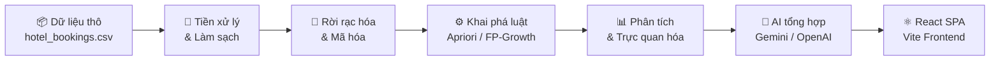
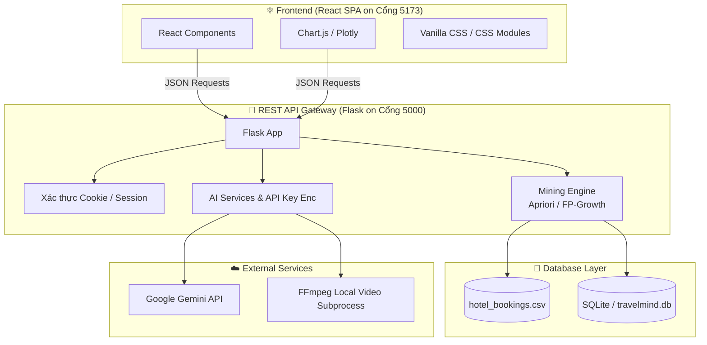
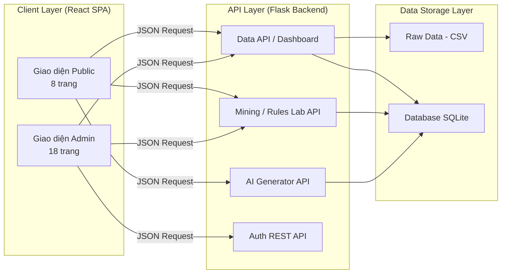

<p align="center">
  
</p>

<h1 align="center">🧠 TravelMind</h1>

<p align="center">
  <strong>Hệ thống phân tích hành vi khách hàng & gợi ý combo du lịch thông minh</strong>
</p>

<p align="center">
  <em>Khai phá luật kết hợp (Association Rules) trên dữ liệu đặt phòng khách sạn — Xây dựng nền tảng web thương mại thông minh tích hợp AI</em>
</p>

<p align="center">
  
  
  
  
  
  
  
</p>

---

## 📋 Mục lục

- [1. Giới thiệu đề tài](#1-giới-thiệu-đề-tài)
- [2. Bài toán & Giải pháp](#2-bài-toán--giải-pháp)
- [3. Bộ dữ liệu](#3-bộ-dữ-liệu)
- [4. Công nghệ sử dụng](#4-công-nghệ-sử-dụng)
- [5. Kiến trúc hệ thống](#5-kiến-trúc-hệ-thống)
- [6. Cấu trúc dự án](#6-cấu-trúc-dự-án)
- [7. Tính năng hệ thống](#7-tính-năng-hệ-thống)
- [8. Ánh xạ yêu cầu chấm điểm](#8-ánh-xạ-yêu-cầu-chấm-điểm)
- [9. Hướng dẫn cài đặt & chạy](#9-hướng-dẫn-cài-đặt--chạy)
- [10. Tài liệu tham khảo](#10-tài-liệu-tham-khảo)

---

## 1. Giới thiệu đề tài

**TravelMind** là một nền tảng web phân tích hành vi khách hàng trong ngành du lịch – khách sạn, ứng dụng kỹ thuật **Khai phá luật kết hợp (Association Rules Mining)** để tìm ra các mẫu hành vi tiềm ẩn từ dữ liệu đặt phòng thực tế. Từ đó, hệ thống tự động gợi ý các **combo dịch vụ du lịch thông minh** giúp doanh nghiệp tối ưu hóa doanh thu và nâng cao trải nghiệm khách hàng.

> **Môn học:** Khai phá dữ liệu  
> **Loại đồ án:** Đồ án môn học  
> **Lĩnh vực:** Du lịch – Khách sạn (Hospitality & Tourism)

---

## 2. Bài toán & Giải pháp

### 2.1. Phát biểu bài toán

Ngành du lịch – khách sạn tạo ra lượng dữ liệu khổng lồ từ các giao dịch đặt phòng hàng ngày, nhưng phần lớn chưa được khai thác hiệu quả:

| Thách thức | Mô tả |
|---|---|
| 📊 **Dữ liệu chưa khai thác** | Hàng trăm nghìn bản ghi đặt phòng chỉ được dùng cho báo cáo đơn giản |
| 🔍 **Thiếu hiểu biết hành vi** | Không biết khách hàng có xu hướng kết hợp dịch vụ nào cùng nhau |
| 💡 **Gợi ý thủ công** | Các combo dịch vụ được tạo dựa trên kinh nghiệm, không có cơ sở dữ liệu |
| 📉 **Tỷ lệ hủy cao** | ~37% booking bị hủy, cần hiểu nguyên nhân để giảm thiểu |
| 🎯 **Cá nhân hóa kém** | Chưa phân nhóm khách hàng để đưa ra ưu đãi phù hợp |

### 2.2. Giải pháp đề xuất

**TravelMind** giải quyết bài toán trên bằng phương pháp **kết hợp khai phá luật kết hợp với nền tảng web thương mại tách biệt (Decoupled Architecture) tích hợp AI:**



**Các thành phần cốt lõi:**

1. **Data Pipeline:** Thu thập → Làm sạch → Biến đổi → Rời rạc hóa dữ liệu
2. **Mining Engine:** Áp dụng thuật toán Apriori và FP-Growth để khai phá frequent itemsets và luật kết hợp
3. **AI Insights:** Sử dụng LLM (Gemini/OpenAI) để diễn giải luật kết hợp thành ngôn ngữ tự nhiên và tạo gợi ý combo
4. **Decoupled Web Platform:** Flask REST API cung cấp dữ liệu JSON; React SPA (Vite) hiển thị trực quan và mượt mà.

---

## 3. Bộ dữ liệu

| Thuộc tính | Chi tiết |
|---|---|
| **Tên file** | `hotel_bookings.csv` |
| **Nguồn** | [Kaggle – Hotel Booking Demand](https://www.kaggle.com/datasets/jessemostipak/hotel-booking-demand) |
| **Bài báo gốc** | Antonio, N., de Almeida, A., & Nunes, L. (2019). *Hotel booking demand datasets.* Data in Brief, 22, 41–49. [ScienceDirect](https://doi.org/10.1016/j.dib.2018.11.126) |
| **Kích thước** | 119.390 dòng × 32 cột (~16,8 MB) |
| **Thời gian** | Tháng 7/2015 – Tháng 8/2017 |
| **Phạm vi** | 2 khách sạn tại Bồ Đào Nha (1 Resort Hotel, 1 City Hotel) |
| **Giá trị thiếu** | `company` (94,31%), `agent` (13,69%), `country` (0,41%), `children` (0,003%) |

> [!NOTE]
> Chi tiết đầy đủ về từng cột dữ liệu, phân tích EDA và kế hoạch tiền xử lý được trình bày trong [docs/01_du_lieu.md](docs/01_du_lieu.md).

---

## 4. Công nghệ sử dụng

### 4.1. Bảng tổng hợp công nghệ

| Lớp | Công nghệ | Vai trò |
|---|---|---|
| **Backend (API)** | Python 3.10+, Flask, Flask-CORS | REST API server cung cấp dữ liệu JSON |
| **Xử lý dữ liệu** | pandas, NumPy, SQLAlchemy | Tiền xử lý, import dữ liệu, thống kê dữ liệu |
| **Khai phá luật** | mlxtend (Apriori, FP-Growth) | Tìm frequent itemsets & sinh luật kết hợp |
| **Trực quan hóa** | Chart.js, Plotly.js (React wrapper) | Biểu đồ tương tác mượt mà trên React |
| **Frontend** | React 18, Vite, React Router 6 | Single Page Application (SPA) |
| **Styling (CSS)** | CSS thuần (CSS Modules) | Giao diện kính mờ (Glassmorphism), vi hoạt ảnh |
| **AI / LLM** | Gemini API / OpenAI API | Diễn giải luật, sinh mô tả và banner bằng AI |
| **Lưu trữ** | CSV / SQLite | Dữ liệu nguồn & cơ sở dữ liệu quan hệ |

### 4.2. Sơ đồ kiến trúc Decoupled



---

## 5. Kiến trúc hệ thống

Hệ thống **TravelMind** được thiết kế theo kiến trúc **Decoupled RESTful:**



---

## 6. Cấu trúc dự án

```
DAMH/
├── 📄 README.md                        # Tổng quan dự án (file này)
├── 📄 hotel_bookings.csv               # Bộ dữ liệu gốc (nằm trong thư mục hotel_bookings.csv/)
│
├── 📁 docs/                            # 📖 Tài liệu dự án
│   ├── 01_du_lieu.md                   # Thu thập & phân tích dữ liệu
│   ├── 02_lam_sach_du_lieu.md          # Làm sạch & tăng cường dữ liệu
│   ├── 03_thuat_toan.md               # Mô hình & thuật toán (Apriori, FP-Growth)
│   ├── 04_kien_truc_he_thong.md       # Thiết kế kiến trúc hệ thống
│   ├── 05_database.md                 # Thiết kế cơ sở dữ liệu SQLite
│   ├── 06_dac_ta_chuc_nang.md         # Đặc tả chi tiết 28 chức năng
│   └── 07_api_reference.md            # Tài liệu API endpoints
│
├── 📁 backend/                         # 🔌 REST API Backend (Flask)
│   ├── app/
│   │   ├── __init__.py                 # Khởi tạo App Factory & CORS
│   │   ├── config.py                   # Cấu hình app
│   │   ├── extensions.py               # db, login, cors
│   │   ├── models/                     # 17 SQLAlchemy models
│   │   ├── routes/                     # Các API routes trả về JSON
│   │   └── services/                   # Service xử lý logic, mining, AI
│   ├── data/                           # Dữ liệu CSV và kết quả
│   ├── scripts/                        # Scripts import, clean, seed data
│   ├── requirements.txt                # dependencies backend
│   ├── run.py                          # Chạy Backend (localhost:5000)
│   └── .env                            # Cấu hình môi trường (gitignored)
│
└── 📁 frontend/                        # ⚛️ React SPA Frontend (Vite)
    ├── src/
    │   ├── assets/                     # Media tĩnh
    │   ├── components/                 # Các component tái sử dụng (Glassmorphism)
    │   ├── pages/                      # 28 trang giao diện React
    │   ├── services/                   # Gọi API backend (Axios/Fetch)
    │   ├── styles/                     # CSS Modules thiết kế giao diện
    │   ├── App.jsx                     # Cấu hình Routing
    │   └── main.jsx
    ├── package.json                    # dependencies frontend
    ├── vite.config.js                  # Proxy cấu hình sang localhost:5000
    └── index.html
```

---

## 7. Tính năng hệ thống

Hệ thống TravelMind gồm **28 tính năng** được phân thành 3 nhóm chính:

### 7.1. 🌐 Trang công khai (8 trang React)
- **Trang chủ / Landing Page:** Giới thiệu TravelMind, banner AI, combo hot, xu hướng đặt phòng.
- **Khách sạn / Hotel Explorer:** Duyệt & so sánh thống kê thực tế Resort vs City Hotel.
- **Gợi ý Combo / Smart Combo Builder:** Form lọc thông minh và nhận gợi ý Top-3 combo xếp hạng từ luật kết hợp.
- **Traveler Quiz:** 5 câu hỏi phân loại Persona du khách (Planner, Last-Minute, Business, Romantic, Family) kèm combo tương ứng.
- **Quy trình đặt phòng / Booking Flow:** Form đặt phòng demo, thu thập đủ 27 trường để đồng bộ phân tích, gợi ý upsell nâng cấp dịch vụ và áp dụng mã voucher.
- **Trực quan hóa / Travel Insights:** Khám phá dữ liệu EDA tương tác qua biểu đồ Plotly và bản đồ quốc gia.
- **Chi tiết sự kiện / Event Detail Page:** Trang hiển thị các thông tin khuyến mãi, banner, combo đính kèm sự kiện.
- **Hồ sơ cá nhân / User Profile:** Xem lịch sử đặt phòng, quản lý voucher đã nhận và kết quả quiz.

### 7.2. 🔒 Trang quản trị (18 trang React)
- **Dashboard KPI:** Tổng hợp các KPI kinh doanh quan trọng và 4 biểu đồ trực quan hóa doanh thu, kênh đặt phòng.
- **Quản lý dữ liệu / Data Manager:** Phân trang, tìm kiếm và duyệt danh sách dữ liệu booking.
- **Rules Lab:** Điều chỉnh min_support, min_confidence, chạy thuật toán Apriori/FP-growth và xem biểu đồ mạng lưới luật kết hợp (Network Graph).
- **Quản lý kinh doanh (Combo, Promotion, Event, Banner, Voucher Managers):** CRUD các gói combo, ưu đãi, sự kiện tiếp thị và mã voucher.
- **Báo cáo hiệu suất / Performance Reports:** Theo dõi tỷ lệ chuyển đổi của combo, doanh thu từ sự kiện và tỷ lệ sử dụng voucher.
- **Phân khúc khách hàng / Customer Analysis:** Báo cáo chi tiết đặc điểm hành vi của 5 persona khách hàng.
- **AI Content Studio & Media Studios:** Sinh bài mô tả chi tiết bằng Gemini LLM, sinh ảnh banner bằng Image API, sinh video slideshow bằng FFmpeg. Có quy trình kiểm duyệt (Draft -> Approve -> Publish).
- **Cấu hình hệ thống (API Keys, AI Usage):** Thiết lập khóa API mã hóa AES-256 và theo dõi hạn mức, chi phí AI sử dụng.

### 7.3. 🔐 Xác thực (2 trang React)
- **Đăng nhập & Đăng ký:** Đăng nhập, đăng ký tài khoản phân quyền User/Admin qua Session cookie bảo mật.

---

## 8. Ánh xạ yêu cầu chấm điểm

Bảng ánh xạ giữa yêu cầu chấm điểm của môn học với tài liệu và tính năng tương ứng:

| Yêu cầu | Điểm | Tài liệu | Tính năng liên quan | Mô tả |
|---|---|---|---|---|
| **Thu thập & phân tích dữ liệu** | 1,5đ | [01_du_lieu.md](docs/01_du_lieu.md) | Insights, Data Manager | Mô tả nguồn dữ liệu, EDA, phân tích 32 cột, trực quan hóa phân phối |
| **Làm sạch & tăng cường dữ liệu** | 1,5đ | [02_lam_sach_du_lieu.md](docs/02_lam_sach_du_lieu.md) | clean_data.py, data_service.py | Xử lý missing values, outliers, feature engineering 15 biến rời rạc |
| **Mô hình & thuật toán** | 2,0đ | [03_thuat_toan.md](docs/03_thuat_toan.md) | Rules Lab, mining_service.py | Lý thuyết & triển khai Apriori, FP-Growth, đánh giá & so sánh kết quả |
| **Xây dựng ứng dụng** | 3,0đ | [04_kien_truc_he_thong.md](docs/04_kien_truc_he_thong.md), [05_database.md](docs/05_database.md), [06_dac_ta_chuc_nang.md](docs/06_dac_ta_chuc_nang.md), [07_api_reference.md](docs/07_api_reference.md) | Giao diện React & Flask APIs | Thiết kế kiến trúc decoupled, database schema 17 bảng, UI/UX premium, 28 trang React, API, tích hợp AI |
| | **Tổng: 8,0đ** | | | |

---

## 9. Hướng dẫn cài đặt & chạy

### 9.1. Khởi chạy Backend (Flask REST API)

```bash
cd backend
python -m venv venv

# Windows
venv\Scripts\activate
# macOS/Linux
source venv/bin/activate

pip install -r requirements.txt

# Cấu hình biến môi trường
cp .env.example .env
# Chỉnh sửa .env: thêm SECRET_KEY, AI_ENCRYPTION_KEY, GEMINI_API_KEY...

# Chạy lệnh khởi tạo dữ liệu
python scripts/import_data.py
python scripts/seed_admin.py

# Khởi chạy backend API (cổng 5000)
python run.py
```

### 9.2. Khởi chạy Frontend (React Vite SPA)

```bash
cd frontend
npm install

# Khởi chạy Vite dev server (cổng 5173, tự động proxy yêu cầu /api sang cổng 5000)
npm run dev
```

---

## 10. Tài liệu tham khảo

1. **Antonio, N., de Almeida, A., & Nunes, L.** (2019). Hotel booking demand datasets. *Data in Brief*, 22, 41–49. DOI: [10.1016/j.dib.2018.11.126](https://doi.org/10.1016/j.dib.2018.11.126)
2. **Agrawal, R., & Srikant, R.** (1994). Fast Algorithms for Mining Association Rules. *Proceedings of the 20th International Conference on Very Large Data Bases (VLDB)*, 487–499.
3. **Han, J., Pei, J., & Yin, Y.** (2000). Mining Frequent Patterns without Candidate Generation. *ACM SIGMOD Record*, 29(2), 1–12.
4. **mlxtend** – Machine Learning Extensions for Python: [rasbt.github.io/mlxtend](http://rasbt.github.io/mlxtend/)
5. **Google Gemini API**: [ai.google.dev/docs](https://ai.google.dev/docs)

---

<p align="center">
  <strong>TravelMind</strong> — Biến dữ liệu đặt phòng thành tri thức kinh doanh 🚀
</p>
