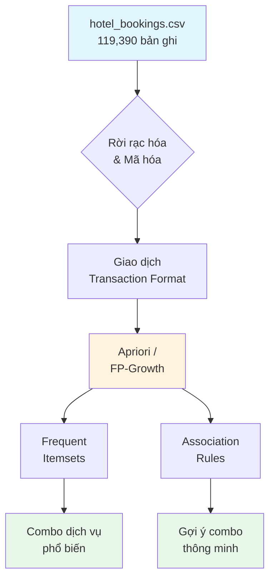
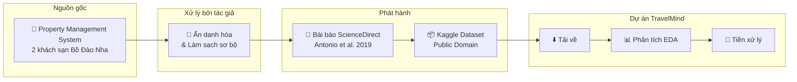
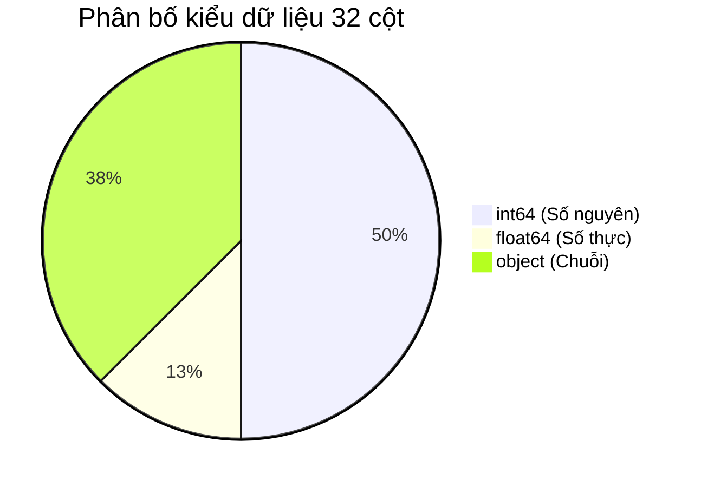
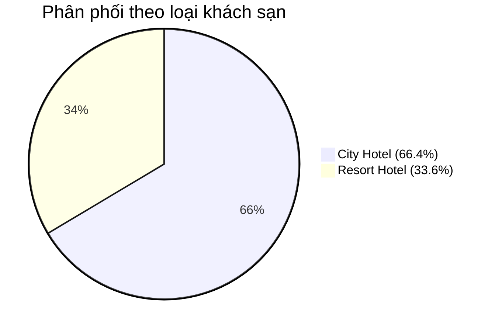
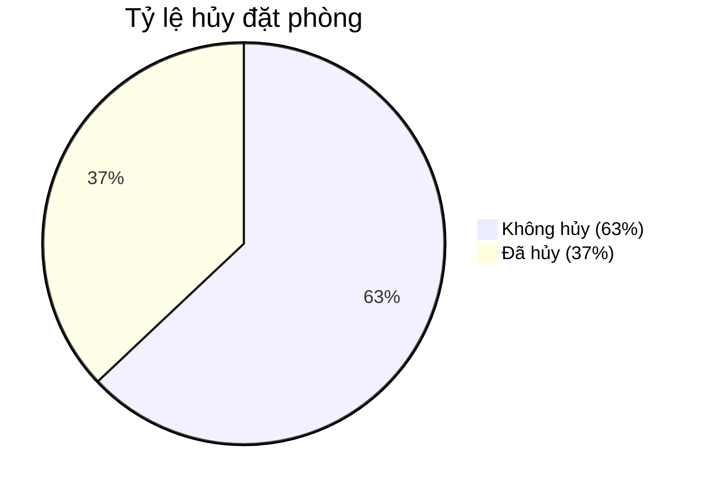
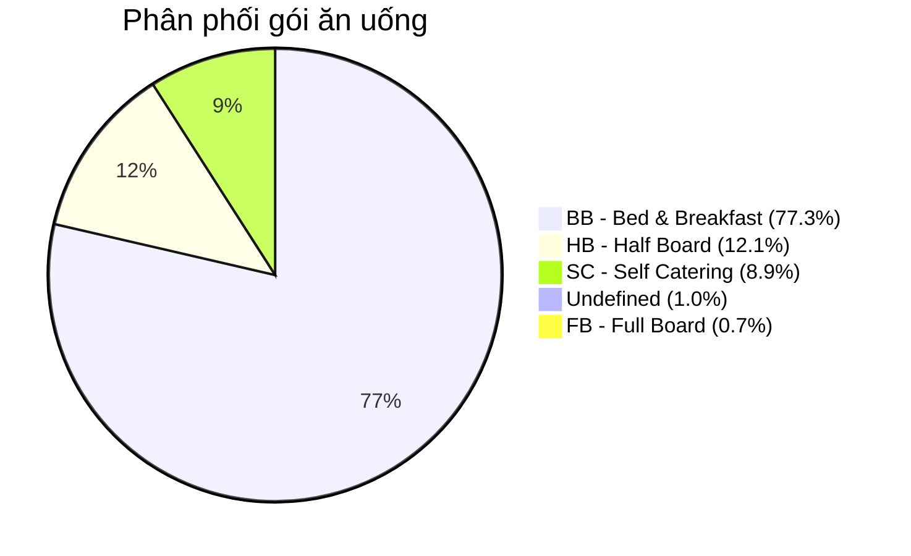
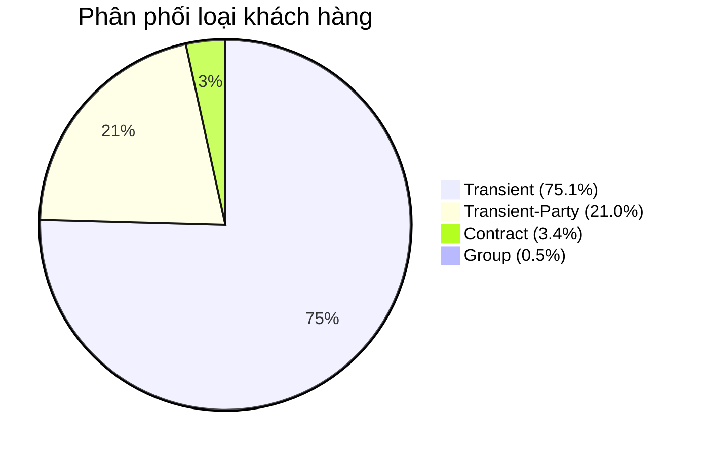
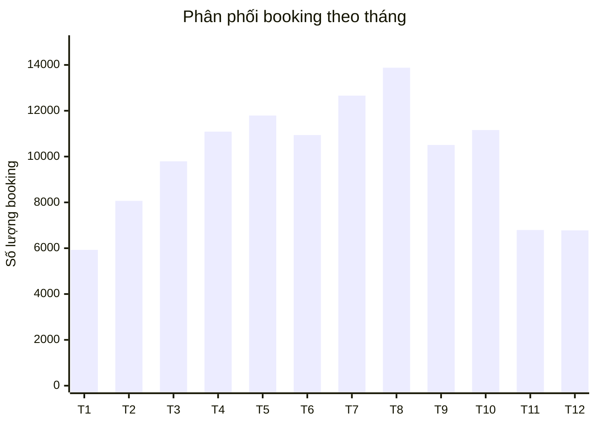
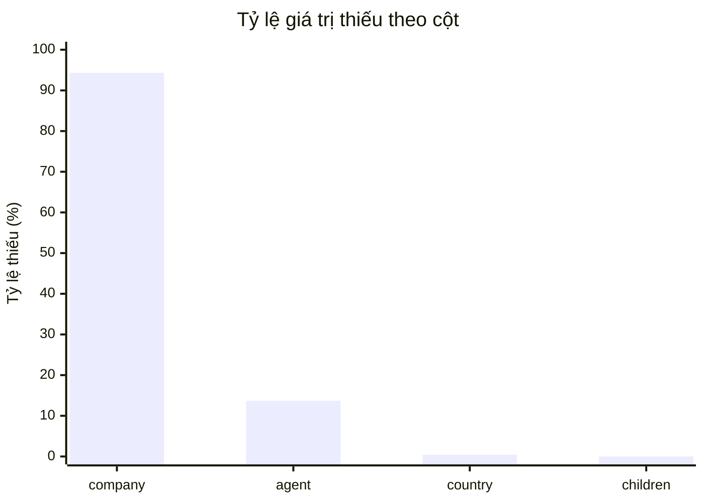
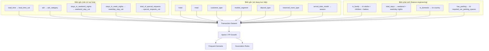

# 📊 Thu thập & Phân tích Dữ liệu

> **Tài liệu:** 01 — Thu thập & Phân tích Dữ liệu  
> **Dự án:** TravelMind — Hệ thống phân tích hành vi khách hàng & gợi ý combo du lịch thông minh  
> **Yêu cầu chấm điểm:** Thu thập/phân tích dữ liệu (1,5đ)  
> **Vị trí file trong dự án:** `backend/data/raw/hotel_bookings.csv`  
> **Script import:** `backend/scripts/import_data.py` → nạp vào bảng `bookings` trong `backend/instance/travelmind.db`

---

## 📋 Mục lục

- [1. Nguồn dữ liệu](#1-nguồn-dữ-liệu)
- [2. Mô tả chi tiết từng cột](#2-mô-tả-chi-tiết-từng-cột)
  - [2.1. Nhóm thông tin khách sạn & đặt phòng](#21-nhóm-thông-tin-khách-sạn--đặt-phòng)
  - [2.2. Nhóm thông tin thời gian](#22-nhóm-thông-tin-thời-gian)
  - [2.3. Nhóm thông tin khách hàng](#23-nhóm-thông-tin-khách-hàng)
  - [2.4. Nhóm thông tin dịch vụ & phòng](#24-nhóm-thông-tin-dịch-vụ--phòng)
  - [2.5. Nhóm thông tin kênh phân phối](#25-nhóm-thông-tin-kênh-phân-phối)
  - [2.6. Nhóm thông tin tài chính & trạng thái](#26-nhóm-thông-tin-tài-chính--trạng-thái)
- [3. Phân tích khám phá (EDA)](#3-phân-tích-khám-phá-eda)
  - [3.1. Tổng quan dữ liệu](#31-tổng-quan-dữ-liệu)
  - [3.2. Phân phối theo loại khách sạn](#32-phân-phối-theo-loại-khách-sạn)
  - [3.3. Phân tích tỷ lệ hủy phòng](#33-phân-tích-tỷ-lệ-hủy-phòng)
  - [3.4. Phân tích dịch vụ ăn uống (Meal)](#34-phân-tích-dịch-vụ-ăn-uống-meal)
  - [3.5. Phân tích loại phòng](#35-phân-tích-loại-phòng)
  - [3.6. Phân tích loại khách hàng](#36-phân-tích-loại-khách-hàng)
  - [3.7. Phân tích loại đặt cọc](#37-phân-tích-loại-đặt-cọc)
  - [3.8. Phân tích giá phòng (ADR)](#38-phân-tích-giá-phòng-adr)
  - [3.9. Phân tích quốc gia khách hàng](#39-phân-tích-quốc-gia-khách-hàng)
  - [3.10. Phân tích tính mùa vụ](#310-phân-tích-tính-mùa-vụ)
  - [3.11. Phân tích giá trị thiếu](#311-phân-tích-giá-trị-thiếu)
  - [3.12. Phân tích kênh phân phối & phân khúc thị trường](#312-phân-tích-kênh-phân-phối--phân-khúc-thị-trường)
- [4. Kết luận phân tích](#4-kết-luận-phân-tích)

---

## 1. Nguồn dữ liệu

### 1.1. Thông tin tổng quan

| Thuộc tính | Chi tiết |
|---|---|
| **Tên dataset** | Hotel Booking Demand |
| **File** | `hotel_bookings.csv` |
| **Vị trí trong dự án** | `backend/data/raw/hotel_bookings.csv` |
| **Nguồn** | [Kaggle – Hotel Booking Demand](https://www.kaggle.com/datasets/jessemostipak/hotel-booking-demand) |
| **Bài báo gốc** | Antonio, N., de Almeida, A., & Nunes, L. (2019). *Hotel booking demand datasets.* Data in Brief, 22, 41–49. [DOI: 10.1016/j.dib.2018.11.126](https://doi.org/10.1016/j.dib.2018.11.126) |
| **Kích thước** | **119.390 dòng** × **32 cột** |
| **Dung lượng** | ~16,8 MB |
| **Thời gian thu thập** | Tháng 7/2015 – Tháng 8/2017 (khoảng 2 năm) |
| **Phạm vi** | 2 khách sạn thực tế tại **Bồ Đào Nha** (Portugal) |
| **Loại khách sạn** | 1 **Resort Hotel** (nghỉ dưỡng) + 1 **City Hotel** (thành phố) |
| **Định dạng** | CSV (Comma-Separated Values) |
| **Giấy phép** | Creative Commons – CC0 1.0 Universal |

### 1.2. Bối cảnh & Tính ứng dụng

Bộ dữ liệu này ghi lại thông tin chi tiết của **119.390 lượt đặt phòng khách sạn**, bao gồm cả các booking thành công và bị hủy. Dữ liệu được thu thập trực tiếp từ hệ thống quản lý khách sạn (Property Management System – PMS) của hai khách sạn thực tế tại Bồ Đào Nha.

**Ý nghĩa đối với dự án TravelMind:**

Mỗi bản ghi đặt phòng chứa thông tin phong phú về: **loại khách sạn, thời gian lưu trú, dịch vụ ăn uống, loại phòng, phân khúc khách hàng, kênh đặt phòng, giá phòng, yêu cầu đặc biệt**... Đây là nguồn dữ liệu lý tưởng để khai phá các **mẫu kết hợp dịch vụ (service combination patterns)** phục vụ cho bài toán gợi ý combo du lịch.

### 1.3. Quy trình thu thập dữ liệu

> [!NOTE]
> Dữ liệu đã được các tác giả gốc **ẩn danh hóa** (anonymized) để bảo vệ quyền riêng tư. Không có thông tin cá nhân nào của khách hàng được lưu trữ trong dataset. Các cột nhận dạng như `agent` và `company` chỉ lưu mã ID, không lưu tên cụ thể.

---

## 2. Mô tả chi tiết từng cột

Bộ dữ liệu gồm **32 cột**, được phân thành 6 nhóm logic. Bảng dưới đây mô tả chi tiết từng cột với các thông tin: kiểu dữ liệu, mô tả, giá trị mẫu, số giá trị duy nhất, và mức độ liên quan đến bài toán khai phá luật kết hợp.

**Quy ước mức độ liên quan (Relevance):**
- ⭐⭐⭐ — **Rất quan trọng:** Trực tiếp tham gia vào quá trình khai phá luật kết hợp
- ⭐⭐ — **Quan trọng:** Hỗ trợ phân tích, tạo feature mới, hoặc lọc dữ liệu
- ⭐ — **Ít liên quan:** Thông tin bổ sung, có thể bỏ qua trong mining

### 2.1. Nhóm thông tin khách sạn & đặt phòng

| # | Cột | Kiểu dữ liệu | Mô tả | Giá trị mẫu | Số giá trị duy nhất | Liên quan |
|---|---|---|---|---|---|---|
| 1 | `hotel` | object (string) | Loại khách sạn — phân loại khách sạn thành hai nhóm chính | `Resort Hotel`, `City Hotel` | 2 | ⭐⭐⭐ |
| 2 | `is_canceled` | int64 | Trạng thái hủy đặt phòng — cho biết booking có bị hủy hay không | `0` (không hủy), `1` (đã hủy) | 2 | ⭐⭐⭐ |
| 3 | `lead_time` | int64 | Thời gian đặt trước — số ngày từ lúc đặt phòng đến ngày nhận phòng | `0`, `7`, `30`, `150`, `365` | 479 | ⭐⭐ |

### 2.2. Nhóm thông tin thời gian

| # | Cột | Kiểu dữ liệu | Mô tả | Giá trị mẫu | Số giá trị duy nhất | Liên quan |
|---|---|---|---|---|---|---|
| 4 | `arrival_date_year` | int64 | Năm đến — năm mà khách dự kiến nhận phòng | `2015`, `2016`, `2017` | 3 | ⭐ |
| 5 | `arrival_date_month` | object (string) | Tháng đến — tháng mà khách dự kiến nhận phòng (tên tiếng Anh) | `January`, `July`, `December` | 12 | ⭐⭐⭐ |
| 6 | `arrival_date_week_number` | int64 | Số tuần trong năm — tuần thứ mấy trong năm (ISO week) | `1`, `27`, `53` | 53 | ⭐ |
| 7 | `arrival_date_day_of_month` | int64 | Ngày trong tháng — ngày cụ thể khách dự kiến đến | `1`, `15`, `31` | 31 | ⭐ |
| 8 | `stays_in_weekend_nights` | int64 | Số đêm cuối tuần — số đêm lưu trú rơi vào thứ 7 và chủ nhật | `0`, `1`, `2`, `4` | 17 | ⭐⭐⭐ |
| 9 | `stays_in_week_nights` | int64 | Số đêm trong tuần — số đêm lưu trú rơi vào thứ 2 đến thứ 6 | `0`, `1`, `2`, `5`, `10` | 35 | ⭐⭐⭐ |

### 2.3. Nhóm thông tin khách hàng

| # | Cột | Kiểu dữ liệu | Mô tả | Giá trị mẫu | Số giá trị duy nhất | Liên quan |
|---|---|---|---|---|---|---|
| 10 | `adults` | int64 | Số người lớn — số lượng người lớn trong booking | `1`, `2`, `3` | 14 | ⭐⭐⭐ |
| 11 | `children` | float64 | Số trẻ em — số lượng trẻ em (có 4 giá trị thiếu) | `0`, `1`, `2`, `3` | 6 | ⭐⭐⭐ |
| 12 | `babies` | int64 | Số trẻ sơ sinh — số lượng em bé dưới 1 tuổi | `0`, `1`, `2` | 5 | ⭐⭐ |
| 13 | `country` | object (string) | Quốc gia — mã quốc gia ISO 3166-1 alpha-3 của khách hàng (488 giá trị thiếu) | `PRT`, `GBR`, `FRA`, `ESP`, `DEU` | 178 | ⭐⭐ |
| 14 | `customer_type` | object (string) | Loại khách hàng — phân loại theo tính chất booking | `Transient`, `Contract`, `Transient-Party`, `Group` | 4 | ⭐⭐⭐ |
| 15 | `is_repeated_guest` | int64 | Khách quay lại — khách đã từng đặt phòng trước đó hay chưa | `0` (mới), `1` (quay lại) | 2 | ⭐⭐ |
| 16 | `previous_cancellations` | int64 | Số lần hủy trước đó — tổng số booking khách đã hủy trước đây | `0`, `1`, `2`, `11` | 15 | ⭐⭐ |
| 17 | `previous_bookings_not_canceled` | int64 | Số lần đặt thành công trước đó — tổng booking trước đây không bị hủy | `0`, `1`, `5`, `20` | 73 | ⭐⭐ |

### 2.4. Nhóm thông tin dịch vụ & phòng

| # | Cột | Kiểu dữ liệu | Mô tả | Giá trị mẫu | Số giá trị duy nhất | Liên quan |
|---|---|---|---|---|---|---|
| 18 | `meal` | object (string) | Gói ăn uống — loại bữa ăn đã đặt kèm | `BB` (Bed & Breakfast), `HB` (Half Board), `FB` (Full Board), `SC` (Self Catering), `Undefined` | 5 | ⭐⭐⭐ |
| 19 | `reserved_room_type` | object (string) | Loại phòng đã đặt — mã loại phòng khách yêu cầu ban đầu | `A`, `B`, `C`, `D`, `E`, `F`, `G`, `H`, `L`, `P` | 10 | ⭐⭐⭐ |
| 20 | `assigned_room_type` | object (string) | Loại phòng được xếp — mã loại phòng thực tế khách nhận | `A`, `B`, `C`, `D`, `E`, `F`, `G`, `H`, `I`, `K`, `L` | 12 | ⭐⭐ |
| 21 | `booking_changes` | int64 | Số lần thay đổi — số lần booking bị chỉnh sửa trước ngày nhận phòng | `0`, `1`, `2`, `5` | 21 | ⭐⭐ |
| 22 | `required_car_parking_spaces` | int64 | Số chỗ đỗ xe — số chỗ đỗ xe khách yêu cầu | `0`, `1`, `2`, `3` | 5 | ⭐⭐⭐ |
| 23 | `total_of_special_requests` | int64 | Số yêu cầu đặc biệt — tổng số yêu cầu đặc biệt của khách (phòng tầng cao, giường phụ...) | `0`, `1`, `2`, `3`, `4`, `5` | 6 | ⭐⭐⭐ |

### 2.5. Nhóm thông tin kênh phân phối

| # | Cột | Kiểu dữ liệu | Mô tả | Giá trị mẫu | Số giá trị duy nhất | Liên quan |
|---|---|---|---|---|---|---|
| 24 | `market_segment` | object (string) | Phân khúc thị trường — kênh tiếp cận khách hàng | `Online TA`, `Offline TA/TO`, `Direct`, `Corporate`, `Groups`, `Complementary`, `Aviation` | 8 | ⭐⭐⭐ |
| 25 | `distribution_channel` | object (string) | Kênh phân phối — phương thức phân phối booking | `TA/TO`, `Direct`, `Corporate`, `GDS` | 5 | ⭐⭐ |
| 26 | `agent` | float64 | Mã đại lý — ID của đại lý du lịch thực hiện booking (16.340 giá trị thiếu = 13,69%) | `9.0`, `14.0`, `240.0`, `NULL` | 334 | ⭐ |
| 27 | `company` | float64 | Mã công ty — ID của công ty/tổ chức liên kết (112.593 giá trị thiếu = 94,31%) | `110.0`, `223.0`, `NULL` | 353 | ⭐ |

### 2.6. Nhóm thông tin tài chính & trạng thái

| # | Cột | Kiểu dữ liệu | Mô tả | Giá trị mẫu | Số giá trị duy nhất | Liên quan |
|---|---|---|---|---|---|---|
| 28 | `deposit_type` | object (string) | Loại đặt cọc — hình thức đặt cọc của booking | `No Deposit`, `Non Refund` (không hoàn), `Refundable` (hoàn được) | 3 | ⭐⭐⭐ |
| 29 | `days_in_waiting_list` | int64 | Số ngày chờ — số ngày booking nằm trong danh sách chờ | `0`, `1`, `50`, `200` | 128 | ⭐ |
| 30 | `adr` | float64 | Giá phòng trung bình/đêm — Average Daily Rate (đơn vị: USD/EUR) | `0`, `50.5`, `94.58`, `200`, `5400` | 8.879 | ⭐⭐⭐ |
| 31 | `reservation_status` | object (string) | Trạng thái đặt phòng — trạng thái cuối cùng của booking | `Check-Out`, `Canceled`, `No-Show` | 3 | ⭐⭐ |
| 32 | `reservation_status_date` | object (string) | Ngày cập nhật trạng thái — ngày trạng thái cuối được ghi nhận | `2015-07-01`, `2017-08-30` | 926 | ⭐ |

### 2.7. Tổng hợp phân loại cột theo kiểu dữ liệu

| Kiểu dữ liệu | Số cột | Danh sách |
|---|---|---|
| **int64** (Số nguyên) | 16 | `is_canceled`, `lead_time`, `arrival_date_year`, `arrival_date_week_number`, `arrival_date_day_of_month`, `stays_in_weekend_nights`, `stays_in_week_nights`, `adults`, `babies`, `is_repeated_guest`, `previous_cancellations`, `previous_bookings_not_canceled`, `booking_changes`, `days_in_waiting_list`, `required_car_parking_spaces`, `total_of_special_requests` |
| **float64** (Số thực) | 4 | `children`, `agent`, `company`, `adr` |
| **object** (Chuỗi) | 12 | `hotel`, `arrival_date_month`, `meal`, `country`, `market_segment`, `distribution_channel`, `reserved_room_type`, `assigned_room_type`, `deposit_type`, `customer_type`, `reservation_status`, `reservation_status_date` |

### 2.8. Tổng hợp các cột ⭐⭐⭐ (Rất quan trọng cho Association Rules)

Các cột sau sẽ được ưu tiên sử dụng trong quá trình khai phá luật kết hợp:

| Cột | Vai trò trong khai phá luật |
|---|---|
| `hotel` | Phân biệt ngữ cảnh Resort vs City |
| `is_canceled` | Lọc booking thành công, phân tích pattern hủy |
| `arrival_date_month` | Phân tích mùa vụ, combo theo mùa |
| `stays_in_weekend_nights` | Pattern lưu trú cuối tuần |
| `stays_in_week_nights` | Pattern lưu trú trong tuần |
| `adults`, `children` | Xác định nhóm khách (gia đình, cặp đôi, solo) |
| `meal` | Dịch vụ ăn uống — thành phần chính của combo |
| `reserved_room_type` | Loại phòng — thành phần chính của combo |
| `customer_type` | Phân khúc khách hàng |
| `market_segment` | Kênh booking — ảnh hưởng đến hành vi |
| `deposit_type` | Mức cam kết tài chính |
| `adr` | Phân nhóm mức giá |
| `required_car_parking_spaces` | Dịch vụ bổ sung |
| `total_of_special_requests` | Mức độ yêu cầu dịch vụ |

---

## 3. Phân tích khám phá (EDA)

### 3.1. Tổng quan dữ liệu

| Chỉ số | Giá trị |
|---|---|
| **Tổng số bản ghi** | 119.390 |
| **Tổng số cột** | 32 |
| **Cột số (numeric)** | 20 |
| **Cột phân loại (categorical)** | 12 |
| **Bộ nhớ ước tính** | ~29,1 MB (in-memory) |
| **Giá trị trùng lặp** | 31.994 dòng (26,8%) |
| **Dòng có giá trị thiếu** | Tối thiểu 129.085 giá trị NULL trên toàn bộ dataset |

> [!NOTE]
> Các dòng trùng lặp trong bối cảnh đặt phòng khách sạn là **hợp lệ** — nhiều khách hàng khác nhau có thể có thông tin booking tương tự nhau. Do đó, không nên xóa bỏ các dòng trùng lặp một cách tùy tiện.

---

### 3.2. Phân phối theo loại khách sạn

| Loại khách sạn | Số lượng | Tỷ lệ |
|---|---|---|
| **City Hotel** (Khách sạn thành phố) | 79.330 | **66,4%** |
| **Resort Hotel** (Khách sạn nghỉ dưỡng) | 40.060 | **33,6%** |
| **Tổng** | **119.390** | **100%** |

**Nhận xét:**
- City Hotel chiếm gần **2/3** tổng số booking, phản ánh nhu cầu du lịch công vụ và thành thị cao tại Bồ Đào Nha.
- Sự chênh lệch này cần được lưu ý khi khai phá luật kết hợp — có thể cần phân tích riêng theo từng loại khách sạn để tìm ra các pattern đặc trưng.

---

### 3.3. Phân tích tỷ lệ hủy phòng

| Trạng thái | Số lượng | Tỷ lệ |
|---|---|---|
| **Không hủy** (`is_canceled = 0`) | 75.166 | **63,0%** |
| **Đã hủy** (`is_canceled = 1`) | 44.224 | **37,0%** |

**Phân tích chi tiết theo `reservation_status`:**

| Trạng thái | Số lượng | Tỷ lệ | Mô tả |
|---|---|---|---|
| `Check-Out` | 75.166 | 63,0% | Khách đã nhận phòng và trả phòng thành công |
| `Canceled` | 43.017 | 36,0% | Booking bị hủy trước ngày nhận phòng |
| `No-Show` | 1.207 | 1,0% | Khách không đến nhận phòng (không báo hủy) |

**Nhận xét:**
- Tỷ lệ hủy **37%** là rất cao — đây là vấn đề nghiêm trọng đối với ngành khách sạn.
- Cần phân tích pattern hủy phòng để tìm mối liên hệ giữa đặc điểm booking và xác suất hủy.
- No-Show (1%) tuy ít nhưng gây thiệt hại lớn vì phòng không thể bán cho khách khác.

> [!WARNING]
> Khi khai phá luật kết hợp cho combo dịch vụ, nên **lọc bỏ các booking đã hủy** (`is_canceled = 0`) để chỉ phân tích pattern từ booking thực tế thành công.

---

### 3.4. Phân tích dịch vụ ăn uống (Meal)

| Gói ăn | Tên đầy đủ | Số lượng | Tỷ lệ |
|---|---|---|---|
| **BB** | Bed & Breakfast (Ngủ & Ăn sáng) | 92.310 | **77,3%** |
| **HB** | Half Board (Bán trọn gói — ăn sáng + 1 bữa) | 14.463 | **12,1%** |
| **SC** | Self Catering (Tự phục vụ) | 10.650 | **8,9%** |
| **Undefined** | Không xác định | 1.169 | **1,0%** |
| **FB** | Full Board (Trọn gói — 3 bữa) | 798 | **0,7%** |

**Nhận xét:**
- **Bed & Breakfast (BB)** chiếm đa số tuyệt đối (77,3%) — đây là gói phổ biến nhất trong ngành khách sạn.
- **Half Board (HB)** đứng thứ 2 với 12,1% — phổ biến ở Resort Hotel cho khách nghỉ dưỡng.
- **Full Board (FB)** rất hiếm (0,7%) — có thể là cơ hội marketing chưa khai thác.
- Biến `meal` là một trong những biến **cốt lõi** cho khai phá combo dịch vụ du lịch.

---

### 3.5. Phân tích loại phòng

**Loại phòng đã đặt (`reserved_room_type`):**

| Loại phòng | Số lượng | Tỷ lệ |
|---|---|---|
| **A** | 85.994 | **72,0%** |
| **D** | 19.201 | **16,1%** |
| **E** | 6.535 | **5,5%** |
| **F** | 2.897 | **2,4%** |
| **G** | 2.094 | **1,8%** |
| **B** | 1.118 | **0,9%** |
| **C** | 932 | **0,8%** |
| **H** | 601 | **0,5%** |
| **L** | 6 | **<0,01%** |
| **P** | 12 | **<0,01%** |

**Nhận xét:**
- Loại phòng **A** chiếm đa số áp đảo (72%) — đây là phòng tiêu chuẩn phổ biến nhất.
- Phòng **D** đứng thứ 2 (16,1%) — có thể là phòng superior hoặc deluxe.
- Các loại phòng cao cấp (F, G, H) chiếm tỷ lệ nhỏ, phản ánh phân khúc luxury hẹp.
- **Sự khác biệt** giữa phòng đặt và phòng được xếp (room upgrade/downgrade) là thông tin quan trọng cho phân tích hành vi.

---

### 3.6. Phân tích loại khách hàng

| Loại khách | Số lượng | Tỷ lệ | Đặc điểm |
|---|---|---|---|
| **Transient** | 89.613 | **75,1%** | Khách lẻ, đặt phòng trực tiếp hoặc qua OTA |
| **Transient-Party** | 25.124 | **21,0%** | Khách lẻ đi theo nhóm/đoàn nhưng đặt riêng |
| **Contract** | 4.076 | **3,4%** | Khách có hợp đồng dài hạn với khách sạn |
| **Group** | 577 | **0,5%** | Khách đoàn/nhóm có hợp đồng |

**Nhận xét:**
- **Transient** (khách lẻ) chiếm 3/4 tổng booking — đây là nhóm khách mục tiêu chính cho gợi ý combo.
- **Transient-Party** (21%) là nhóm tiềm năng cho combo nhóm/gia đình.
- **Contract** và **Group** chiếm tỷ lệ nhỏ nhưng có giá trị booking cao — cần phân tích pattern riêng.

---

### 3.7. Phân tích loại đặt cọc

| Loại đặt cọc | Số lượng | Tỷ lệ |
|---|---|---|
| **No Deposit** (Không đặt cọc) | 104.641 | **87,7%** |
| **Non Refund** (Không hoàn tiền) | 14.587 | **12,2%** |
| **Refundable** (Hoàn tiền được) | 162 | **0,1%** |

**Nhận xét:**
- Phần lớn booking **không yêu cầu đặt cọc** (87,7%) — điều này giải thích một phần tỷ lệ hủy cao (37%).
- **Non Refund** (12,2%) là booking có cam kết tài chính cao hơn — dự đoán tỷ lệ hủy thấp hơn.
- **Refundable** rất hiếm (0,1%) — gần như không được sử dụng.

> [!TIP]
> Mối liên hệ giữa `deposit_type` và `is_canceled` là một luật kết hợp tiềm năng rất mạnh. Ví dụ: `{No Deposit, Online TA} → {Canceled}` có thể có lift cao.

---

### 3.8. Phân tích giá phòng (ADR)

**ADR — Average Daily Rate** là giá trung bình mỗi đêm (tính trên tổng doanh thu / tổng số đêm lưu trú):

| Thống kê | Giá trị |
|---|---|
| **Trung bình (Mean)** | $101,83 |
| **Trung vị (Median)** | $94,58 |
| **Độ lệch chuẩn (Std)** | $50,54 |
| **Giá trị nhỏ nhất (Min)** | **-$6,38** ⚠️ |
| **Phân vị 25% (Q1)** | $69,29 |
| **Phân vị 75% (Q3)** | $126,00 |
| **Giá trị lớn nhất (Max)** | **$5.400,00** ⚠️ |

**Nhận xét:**
- Giá trung bình ~$102/đêm, trung vị ~$95 — phân phối lệch phải (skewed right).
- **Giá trị âm** (-$6,38) là bất thường — có thể do hoàn tiền, điều chỉnh, hoặc lỗi dữ liệu → Cần xử lý.
- **Giá trị cực đại** $5.400/đêm là outlier rõ rệt → Cần kiểm tra và xử lý.
- ADR sẽ được **rời rạc hóa** thành các nhóm giá (budget, economy, standard, premium, luxury) để phục vụ khai phá luật kết hợp.

> [!WARNING]
> Biến `adr` chứa **giá trị ngoại lai** cần được xử lý trước khi mining. Chi tiết xử lý tại [02_lam_sach_du_lieu.md](02_lam_sach_du_lieu.md).

---

### 3.9. Phân tích quốc gia khách hàng

**Top 10 quốc gia có nhiều booking nhất:**

| Hạng | Quốc gia | Mã ISO | Số lượng | Tỷ lệ |
|---|---|---|---|---|
| 1 | 🇵🇹 Bồ Đào Nha | PRT | 48.590 | **40,7%** |
| 2 | 🇬🇧 Vương quốc Anh | GBR | 12.129 | **10,2%** |
| 3 | 🇫🇷 Pháp | FRA | 10.415 | **8,7%** |
| 4 | 🇪🇸 Tây Ban Nha | ESP | 8.568 | **7,2%** |
| 5 | 🇩🇪 Đức | DEU | 7.287 | **6,1%** |
| 6 | 🇮🇹 Ý | ITA | 3.766 | **3,2%** |
| 7 | 🇮🇪 Ireland | IRL | 3.375 | **2,8%** |
| 8 | 🇧🇪 Bỉ | BEL | 2.342 | **2,0%** |
| 9 | 🇧🇷 Brazil | BRA | 2.224 | **1,9%** |
| 10 | 🇳🇱 Hà Lan | NLD | 2.104 | **1,8%** |
| — | Khác (168 quốc gia) | ... | 18.102 | **15,2%** |
| — | **Thiếu (NULL)** | — | **488** | **0,4%** |

**Nhận xét:**
- **Bồ Đào Nha (PRT)** chiếm hơn 40% — khách nội địa là nhóm lớn nhất.
- Top 5 quốc gia (PRT, GBR, FRA, ESP, DEU) chiếm **72,9%** tổng booking — tập trung vào thị trường châu Âu.
- Có **178 quốc gia** khác nhau — dữ liệu đa dạng về nguồn khách.
- 488 giá trị thiếu (0,41%) — tỷ lệ nhỏ, dễ xử lý.

---

### 3.10. Phân tích tính mùa vụ

**Phân phối booking theo tháng (arrival_date_month):**

| Tháng | Số lượng | Đặc điểm |
|---|---|---|
| January (Tháng 1) | ~5.929 | ❄️ Thấp điểm |
| February (Tháng 2) | ~8.068 | ❄️ Thấp điểm |
| March (Tháng 3) | ~9.794 | 🌱 Tăng dần |
| April (Tháng 4) | ~11.089 | 🌱 Tăng dần |
| May (Tháng 5) | ~11.791 | ☀️ Mùa trung |
| June (Tháng 6) | ~10.939 | ☀️ Mùa trung |
| July (Tháng 7) | ~12.661 | 🔥 **Cao điểm** |
| August (Tháng 8) | ~13.877 | 🔥 **Cao điểm** |
| September (Tháng 9) | ~10.508 | 🍂 Giảm dần |
| October (Tháng 10) | ~11.160 | 🍂 Giảm dần |
| November (Tháng 11) | ~6.794 | ❄️ Thấp điểm |
| December (Tháng 12) | ~6.780 | ❄️ Thấp điểm |

**Nhận xét:**
- **Cao điểm:** Tháng 7 và 8 (mùa hè châu Âu) — phù hợp với du lịch nghỉ dưỡng.
- **Thấp điểm:** Tháng 1, 11, 12 (mùa đông) — lượng booking giảm đáng kể.
- Tính mùa vụ rõ rệt → Cần tạo biến `season` để khai phá combo theo mùa.
- Resort Hotel có tính mùa vụ mạnh hơn City Hotel.

---

### 3.11. Phân tích giá trị thiếu

| Cột | Số giá trị thiếu | Tỷ lệ thiếu | Đánh giá |
|---|---|---|---|
| `company` | 112.593 | **94,31%** | 🔴 Rất cao — hầu hết booking không liên kết công ty |
| `agent` | 16.340 | **13,69%** | 🟡 Trung bình — booking trực tiếp không qua đại lý |
| `country` | 488 | **0,41%** | 🟢 Rất thấp — dễ xử lý |
| `children` | 4 | **0,003%** | 🟢 Không đáng kể — dễ xử lý |

**Nhận xét & Kế hoạch xử lý:**

| Cột | Chiến lược xử lý |
|---|---|
| `company` | Thay thế NULL bằng giá trị `0` hoặc tạo biến nhị phân `has_company` (0/1). Cột này có 94% thiếu nên vai trò trong mining rất hạn chế. |
| `agent` | Thay thế NULL bằng `0` (booking trực tiếp). Hoặc tạo biến `has_agent` (0/1). |
| `country` | Thay NULL bằng giá trị `Unknown` hoặc mode (`PRT`). Tỷ lệ rất nhỏ nên ảnh hưởng không đáng kể. |
| `children` | Thay NULL bằng `0` (giả định không có trẻ em). Chỉ 4 dòng nên ảnh hưởng không đáng kể. |

> [!NOTE]
> Chi tiết chiến lược xử lý giá trị thiếu và outliers được trình bày đầy đủ trong [02_lam_sach_du_lieu.md](02_lam_sach_du_lieu.md).

---

### 3.12. Phân tích kênh phân phối & phân khúc thị trường

**Phân khúc thị trường (`market_segment`):**

| Phân khúc | Số lượng | Tỷ lệ | Mô tả |
|---|---|---|---|
| **Online TA** | 56.477 | **47,3%** | Đại lý du lịch trực tuyến (Booking.com, Expedia...) |
| **Offline TA/TO** | 24.219 | **20,3%** | Đại lý / tour operator truyền thống |
| **Direct** | 12.606 | **10,6%** | Đặt trực tiếp với khách sạn |
| **Groups** | 19.811 | **16,6%** | Đặt phòng theo nhóm/đoàn |
| **Corporate** | 5.295 | **4,4%** | Khách doanh nghiệp |
| **Complementary** | 743 | **0,6%** | Khách mời, complimentary |
| **Aviation** | 237 | **0,2%** | Phi hành đoàn, aviation |
| **Undefined** | 2 | **<0,01%** | Không xác định |

**Kênh phân phối (`distribution_channel`):**

| Kênh | Số lượng | Tỷ lệ |
|---|---|---|
| **TA/TO** | 97.870 | **82,0%** |
| **Direct** | 14.645 | **12,3%** |
| **Corporate** | 6.677 | **5,6%** |
| **GDS** | 193 | **0,2%** |
| **Undefined** | 5 | **<0,01%** |

**Nhận xét:**
- **Online TA** (47,3%) là kênh booking phổ biến nhất — phản ánh xu hướng đặt phòng trực tuyến toàn cầu.
- **TA/TO** chiếm 82% kênh phân phối — đại lý du lịch đóng vai trò chi phối.
- Kênh **Direct** (10,6%) còn khiêm tốn — cơ hội để khách sạn phát triển kênh bán hàng trực tiếp.
- Biến `market_segment` rất quan trọng cho khai phá luật kết hợp vì phản ánh **hành vi mua** của khách hàng.

---

## 4. Kết luận phân tích

### 4.1. Tóm tắt phát hiện chính

Qua phân tích khám phá (EDA) bộ dữ liệu `hotel_bookings.csv` với 119.390 bản ghi và 32 cột, dự án đã xác định được các phát hiện quan trọng sau:

| # | Phát hiện | Ý nghĩa cho dự án |
|---|---|---|
| 1 | City Hotel chiếm 66%, Resort Hotel 34% | Cần phân tích riêng theo loại khách sạn để tìm pattern đặc trưng |
| 2 | Tỷ lệ hủy 37% — rất cao | Khai phá pattern hủy phòng bằng Association Rules |
| 3 | BB (Bed & Breakfast) chiếm 77% | Combo ăn uống là thành phần quan trọng nhất |
| 4 | Phòng loại A chiếm 72% | Rời rạc hóa phòng thành nhóm (standard, superior, premium) |
| 5 | Transient chiếm 75% | Focus vào khách lẻ cho gợi ý combo cá nhân |
| 6 | No Deposit chiếm 88% | Liên quan mạnh đến tỷ lệ hủy — luật kết hợp tiềm năng |
| 7 | ADR trung bình ~$102, có outlier | Cần rời rạc hóa và xử lý ngoại lai |
| 8 | Top 5 quốc gia chiếm 73% | Có thể tạo combo theo thị trường |
| 9 | Mùa cao điểm: tháng 7-8 | Combo theo mùa là khả thi |
| 10 | company thiếu 94%, agent thiếu 14% | Cần chiến lược xử lý phù hợp |

### 4.2. Các cột ưu tiên cho khai phá luật kết hợp

Dựa trên phân tích EDA, các cột sau được chọn để xây dựng **transaction dataset** cho Apriori/FP-Growth:

### 4.3. Bước tiếp theo

Dựa trên kết quả phân tích EDA, bước tiếp theo trong pipeline dữ liệu là:

1. **Làm sạch dữ liệu:** Xử lý giá trị thiếu, giá trị ngoại lai (ADR âm, ADR > $1000), và dữ liệu không nhất quán.

2. **Feature Engineering:** Tạo các biến phái sinh (`is_family`, `total_stays`, `season`, `adr_category`...) để làm giàu thông tin cho mining.

3. **Rời rạc hóa:** Chuyển đổi các biến liên tục (`lead_time`, `adr`, `stays_*`) thành biến phân loại phù hợp cho Association Rules.

4. **Xây dựng Transaction Dataset:** Mã hóa one-hot encoding để tạo ma trận giao dịch nhị phân cho thuật toán Apriori/FP-Growth.

> [!IMPORTANT]
> Chi tiết các bước làm sạch, tăng cường và rời rạc hóa dữ liệu được trình bày trong tài liệu tiếp theo: [02_lam_sach_du_lieu.md](./02_lam_sach_du_lieu.md).

---

> [!NOTE]
> **Tài liệu liên quan:**
> - Bước tiếp theo: [02_lam_sach_du_lieu.md](./02_lam_sach_du_lieu.md) — Làm sạch & Tăng cường dữ liệu
> - Thuật toán: [03_thuat_toan.md](./03_thuat_toan.md) — Apriori & FP-Growth
> - Kiến trúc hệ thống: [04_kien_truc_he_thong.md](./04_kien_truc_he_thong.md) — Decoupled Architecture
> - Script import dữ liệu: `backend/scripts/import_data.py`

  <strong>TravelMind</strong> — Tài liệu 01: Thu thập & Phân tích Dữ liệu ✅

