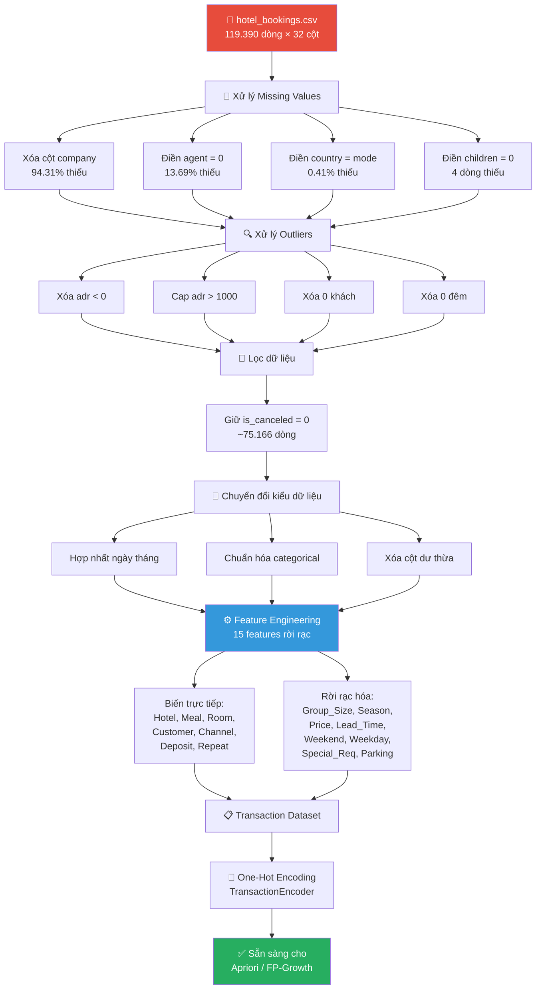

# 📋 Làm Sạch & Tăng Cường Dữ Liệu — TravelMind

> **Dự án:** TravelMind — Phân tích hành vi khách hàng ngành du lịch  
> **Bộ dữ liệu:** `hotel_bookings.csv` (119.390 dòng × 32 cột)  
> **Vị trí file:** `backend/data/raw/hotel_bookings.csv`  
> **Mục tiêu:** Chuẩn bị dữ liệu sạch → tạo tập giao dịch (transaction dataset) cho thuật toán Luật kết hợp (Apriori / FP-Growth)  
> **Script triển khai:** `backend/scripts/clean_data.py`

---

## 1. Tổng quan vấn đề dữ liệu

Sau khi khảo sát sơ bộ bộ dữ liệu `hotel_bookings.csv`, chúng tôi phát hiện **bốn nhóm vấn đề chính** cần xử lý trước khi có thể đưa dữ liệu vào mô hình khai phá luật kết hợp.

### 1.1 Giá trị thiếu (Missing Values)

| Cột | Số dòng thiếu | Tỷ lệ (%) | Mức độ nghiêm trọng |
|---|---:|---:|---|
| `company` | 112.593 | **94,31%** | 🔴 Rất cao — không thể phục hồi |
| `agent` | 16.340 | **13,69%** | 🟡 Trung bình — có thể xử lý |
| `country` | 488 | **0,41%** | 🟢 Thấp — dễ xử lý |
| `children` | 4 | **< 0,01%** | 🟢 Rất thấp — dễ xử lý |

### 1.2 Giá trị bất thường (Outliers)

| Vấn đề | Mô tả | Ảnh hưởng |
|---|---|---|
| `adr < 0` | Giá phòng trung bình/đêm âm | Dữ liệu sai, không có ý nghĩa kinh doanh |
| `adr > 1000` | Giá phòng cực cao (> 1.000 EUR/đêm) | Nhiễu hoặc booking đặc biệt, làm lệch phân phối |
| Không có khách | `adults = 0` VÀ `children = 0` VÀ `babies = 0` | Đặt phòng không hợp lệ |
| Không có đêm ở | `stays_in_weekend_nights = 0` VÀ `stays_in_week_nights = 0` | Booking lỗi hoặc no-show |

### 1.3 Vấn đề kiểu dữ liệu

| Cột | Kiểu hiện tại | Kiểu mong muốn | Ghi chú |
|---|---|---|---|
| `children` | `float64` | `int64` | Do có giá trị NaN nên Pandas tự chuyển sang float |
| `agent` | `float64` | `int64` hoặc `str` | Tương tự, NaN gây float |
| `company` | `float64` | — | Sẽ bị xóa |
| `reservation_status_date` | `object` | `datetime64` | Cần parse sang datetime |
| `arrival_date_month` | `object` (tên tháng tiếng Anh) | `int` hoặc giữ nguyên | Cần ánh xạ sang mùa |

### 1.4 Sự không nhất quán (Inconsistencies)

- **Cột `meal`**: Giá trị `"Undefined"` và `"SC"` (Self-Catering) thực chất cùng nghĩa → gộp lại thành `"SC"`.
- **Cột `market_segment`** và **`distribution_channel`**: Có sự trùng lặp thông tin → chỉ giữ `market_segment` để giảm chiều.
- **Cột `reserved_room_type`** vs **`assigned_room_type`**: Hai cột có thể khác nhau khi khách bị đổi phòng → chỉ sử dụng `reserved_room_type` (phản ánh nhu cầu ban đầu của khách).

---

## 2. Xử lý giá trị thiếu (Missing Values)

### 2.1 Cột `company` — XÓA TOÀN BỘ CỘT

```python
# 94.31% giá trị bị thiếu → cột không sử dụng được
df.drop(columns=['company'], inplace=True)
```

> [!WARNING]
> Với hơn 94% dữ liệu bị thiếu, bất kỳ phương pháp điền giá trị nào cũng sẽ tạo ra sai lệch nghiêm trọng. Quyết định xóa cột là hợp lý nhất.

**Lý do:**
- Không thể điền giá trị cho 112.593 / 119.390 dòng mà vẫn đảm bảo tính chính xác.
- Thông tin về công ty đặt phòng không nằm trong phạm vi phân tích hành vi khách hàng cá nhân.

### 2.2 Cột `agent` — Điền giá trị `0`

```python
# 13.69% thiếu → NaN nghĩa là "khách đặt trực tiếp, không qua đại lý"
df['agent'].fillna(0, inplace=True)
df['agent'] = df['agent'].astype(int)
```

**Lý do:**
- Giá trị thiếu ở cột `agent` cho biết booking đó **không thông qua đại lý** nào → khách tự đặt trực tiếp.
- Điền `0` là hợp lý vì `0` không trùng với mã đại lý nào trong dữ liệu (mã đại lý bắt đầu từ 1).
- Thông tin này sẽ được phản ánh qua cột `market_segment` (giá trị `Direct`).

### 2.3 Cột `country` — Điền giá trị mode hoặc xóa dòng

```python
# Chỉ 488 dòng thiếu (0.41%) → điền bằng quốc gia phổ biến nhất
most_common_country = df['country'].mode()[0]  # Thường là 'PRT' (Portugal)
df['country'].fillna(most_common_country, inplace=True)
```

**Lý do:**
- Tỷ lệ thiếu rất thấp (0,41%), xóa dòng cũng được nhưng điền mode giữ lại được dữ liệu.
- Phương án thay thế: xóa 488 dòng (`df.dropna(subset=['country'])`) — ảnh hưởng không đáng kể.

### 2.4 Cột `children` — Điền giá trị `0`

```python
# Chỉ 4 dòng thiếu → điền 0 (giả định không có trẻ em)
df['children'].fillna(0, inplace=True)
df['children'] = df['children'].astype(int)
```

**Lý do:**
- Chỉ 4 dòng trong 119.390 → ảnh hưởng gần như bằng không.
- Giả định hợp lý: nếu không ghi nhận số trẻ em, nhiều khả năng là không có trẻ em đi cùng.

---

## 3. Xử lý giá trị bất thường (Outliers)

### 3.1 Giá phòng âm: `adr < 0`

```python
# Xóa các dòng có giá phòng âm
print(f"Số dòng có adr < 0: {(df['adr'] < 0).sum()}")
df = df[df['adr'] >= 0]
```

> [!CAUTION]
> Giá phòng trung bình mỗi đêm (Average Daily Rate) **không thể âm** trong thực tế. Đây là dữ liệu lỗi cần loại bỏ.

### 3.2 Giá phòng cực cao: `adr > 1000`

```python
# Giới hạn trên: cap tại 1000 EUR hoặc xóa
# Phương án 1: Cap (giữ dòng, giới hạn giá trị)
df.loc[df['adr'] > 1000, 'adr'] = 1000

# Phương án 2: Xóa (loại bỏ hoàn toàn)
# df = df[df['adr'] <= 1000]
```

**Phân tích:**
- Phần lớn giá phòng nằm trong khoảng 0–300 EUR/đêm.
- Các giá trị > 1.000 EUR rất hiếm và có thể là:
  - Suite đặc biệt, phòng penthouse (hợp lệ nhưng ngoại lai).
  - Lỗi nhập liệu.
- Chúng tôi chọn **cap tại 1.000** để giữ dòng dữ liệu nhưng giảm ảnh hưởng của ngoại lai lên phân tích.

### 3.3 Không có khách nào

```python
# Booking không có khách nào → không hợp lệ
mask_no_guests = (df['adults'] == 0) & (df['children'] == 0) & (df['babies'] == 0)
print(f"Số dòng không có khách: {mask_no_guests.sum()}")
df = df[~mask_no_guests]
```

**Lý do:** Một booking phải có ít nhất 1 người lớn. Các dòng không có khách nào là dữ liệu lỗi hoặc booking kiểm thử.

### 3.4 Không có đêm lưu trú

```python
# Booking có 0 đêm ở cả tuần lẫn cuối tuần → vô nghĩa
mask_no_nights = (df['stays_in_weekend_nights'] == 0) & (df['stays_in_week_nights'] == 0)
print(f"Số dòng 0 đêm lưu trú: {mask_no_nights.sum()}")
df = df[~mask_no_nights]
```

**Lý do:** Nếu khách không ở đêm nào, đó không phải là booking thực sự (có thể là day-use hoặc lỗi dữ liệu). Chúng ta chỉ phân tích hành vi lưu trú thực tế.

---

## 4. Lọc dữ liệu — Chỉ giữ booking thành công

```python
# Lọc chỉ giữ booking KHÔNG bị hủy
df = df[df['is_canceled'] == 0]
print(f"Số dòng sau khi lọc: {len(df)}")
# Kết quả kỳ vọng: ~75.166 dòng
```

> [!IMPORTANT]
> **Tại sao loại bỏ booking đã hủy?**
> 
> Mục tiêu của TravelMind là **phân tích hành vi đặt phòng thực tế** — tức là những gì khách hàng *thực sự sử dụng*. Booking bị hủy không phản ánh hành vi tiêu dùng thực tế:
> - Khách có thể hủy vì thay đổi kế hoạch → không liên quan đến sở thích.
> - Giữ booking hủy sẽ tạo "nhiễu" trong luật kết hợp, dẫn đến gợi ý sai.
> - Sau khi lọc, chúng ta còn **~75.166 dòng** — đủ lớn cho khai phá luật kết hợp.

**Lưu ý:** Cột `is_canceled` sẽ bị xóa sau bước này vì tất cả giá trị đều = 0.

```python
df.drop(columns=['is_canceled'], inplace=True)
```

---

## 5. Chuyển đổi kiểu dữ liệu

### 5.1 Hợp nhất cột ngày tháng

```python
import pandas as pd

# Tạo cột ngày đến đầy đủ
df['arrival_date'] = pd.to_datetime(
    df['arrival_date_year'].astype(str) + '-' +
    df['arrival_date_month'] + '-' +
    df['arrival_date_day_of_month'].astype(str),
    format='%Y-%B-%d'
)

# Sau khi tạo xong, có thể xóa các cột gốc
df.drop(columns=[
    'arrival_date_year',
    'arrival_date_day_of_month',
    'arrival_date_week_number'
], inplace=True)
# Giữ lại 'arrival_date_month' để tạo feature Season ở bước sau
```

### 5.2 Mã hóa biến phân loại (Categorical Encoding)

Trong bước Feature Engineering (mục 6), các biến phân loại sẽ được chuyển đổi thành dạng item cho tập giao dịch. Tại bước này, ta chỉ cần đảm bảo kiểu dữ liệu đúng:

```python
# Đảm bảo các cột phân loại có kiểu đúng
categorical_cols = [
    'hotel', 'meal', 'country', 'market_segment',
    'distribution_channel', 'reserved_room_type',
    'deposit_type', 'customer_type'
]
for col in categorical_cols:
    df[col] = df[col].astype('category')

# Chuẩn hóa meal: 'Undefined' → 'SC'
df['meal'] = df['meal'].replace('Undefined', 'SC')
```

### 5.3 Xóa cột không cần thiết

```python
# Các cột không sử dụng cho phân tích luật kết hợp
cols_to_drop = [
    'reservation_status',       # Trùng với is_canceled (đã lọc)
    'reservation_status_date',  # Không cần cho association rules
    'assigned_room_type',       # Dùng reserved_room_type thay thế
    'distribution_channel',     # Trùng với market_segment
    'booking_changes',          # Không liên quan đến hành vi ban đầu
    'days_in_waiting_list',     # Không ảnh hưởng đến sở thích
    'previous_cancellations',   # Liên quan đến hủy, đã lọc
    'previous_bookings_not_canceled',  # Ít ảnh hưởng
    'country',                  # Quá nhiều giá trị unique, không phù hợp cho AR
    'arrival_date',             # Đã tách ra feature Season
    'agent',                    # Đã xử lý, không dùng cho AR
]
df.drop(columns=cols_to_drop, inplace=True, errors='ignore')
```

---

## 6. Tăng cường dữ liệu — Feature Engineering

> [!IMPORTANT]
> Đây là bước **quan trọng nhất** trong quy trình chuẩn bị dữ liệu. Mục tiêu là chuyển đổi các biến liên tục và phân loại thành các **item rời rạc** (discrete items) phù hợp cho thuật toán Luật kết hợp.

### 6.1 Bảng tổng hợp chuyển đổi

| Feature gốc | Phép biến đổi | Feature mới | Các giá trị |
|---|---|---|---|
| `hotel` | Sử dụng trực tiếp | `Hotel_Type` | `Hotel_Resort`, `Hotel_City` |
| `meal` | Sử dụng trực tiếp | `Meal_Type` | `Meal_BB`, `Meal_HB`, `Meal_FB`, `Meal_SC` |
| `reserved_room_type` | Sử dụng trực tiếp | `Room_Type` | `Room_A`, `Room_B`, …, `Room_H` |
| `customer_type` | Sử dụng trực tiếp | `Customer_Type` | `Cust_Transient`, `Cust_Contract`, `Cust_TransientParty`, `Cust_Group` |
| `market_segment` | Sử dụng trực tiếp | `Channel` | `Ch_OnlineTA`, `Ch_OfflineTA`, `Ch_Direct`, `Ch_Corporate`, `Ch_Groups` |
| `deposit_type` | Sử dụng trực tiếp | `Deposit` | `Dep_NoDeposit`, `Dep_NonRefund`, `Dep_Refundable` |
| `adults` + `children` + `babies` | Rời rạc hóa | `Group_Size` | `Group_Solo`, `Group_Couple`, `Group_Family`, `Group_Large` |
| `arrival_date_month` | Ánh xạ mùa | `Season` | `Season_Spring`, `Season_Summer`, `Season_Autumn`, `Season_Winter` |
| `adr` | Phân bin | `Price_Range` | `Price_Budget`, `Price_Mid`, `Price_Premium` |
| `lead_time` | Rời rạc hóa | `Lead_Time` | `Lead_LastMinute`, `Lead_Short`, `Lead_Medium`, `Lead_Long` |
| `stays_in_weekend_nights` | Rời rạc hóa | `Weekend_Stay` | `Weekend_None`, `Weekend_Short`, `Weekend_Long` |
| `stays_in_week_nights` | Rời rạc hóa | `Weekday_Stay` | `Weekday_Short`, `Weekday_Medium`, `Weekday_Long` |
| `total_of_special_requests` | Rời rạc hóa | `Special_Requests` | `SpecReq_None`, `SpecReq_Few`, `SpecReq_Many` |
| `required_car_parking_spaces` | Nhị phân hóa | `Parking` | `Parking_Yes`, `Parking_No` |
| `is_repeated_guest` | Sử dụng trực tiếp | `Repeat_Guest` | `Repeat_Yes`, `Repeat_No` |

### 6.2 Chi tiết từng phép biến đổi

#### 🏨 Hotel_Type — Loại khách sạn

```python
df['Hotel_Type'] = df['hotel'].map({
    'Resort Hotel': 'Hotel_Resort',
    'City Hotel':   'Hotel_City'
})
```

Biến nhị phân đơn giản, sử dụng trực tiếp mà không cần chuyển đổi.

---

#### 🍽️ Meal_Type — Loại bữa ăn

```python
meal_map = {
    'BB': 'Meal_BB',   # Bed & Breakfast
    'HB': 'Meal_HB',   # Half Board (sáng + tối)
    'FB': 'Meal_FB',   # Full Board (3 bữa)
    'SC': 'Meal_SC'    # Self-Catering (tự nấu)
}
df['Meal_Type'] = df['meal'].map(meal_map)
```

| Giá trị | Ý nghĩa | Mô tả |
|---|---|---|
| `Meal_BB` | Bed & Breakfast | Chỉ bao gồm bữa sáng |
| `Meal_HB` | Half Board | Bữa sáng + 1 bữa chính (thường là tối) |
| `Meal_FB` | Full Board | 3 bữa: sáng, trưa, tối |
| `Meal_SC` | Self-Catering / Undefined | Không bao gồm bữa ăn |

---

#### 🛏️ Room_Type — Loại phòng đặt

```python
df['Room_Type'] = 'Room_' + df['reserved_room_type']
# Kết quả: Room_A, Room_B, Room_C, ..., Room_H
```

Sử dụng **loại phòng đã đặt** (không phải phòng thực tế được gán) vì nó phản ánh **nhu cầu và sở thích ban đầu** của khách.

---

#### 👤 Customer_Type — Loại khách hàng

```python
cust_map = {
    'Transient':       'Cust_Transient',       # Khách lẻ
    'Contract':        'Cust_Contract',         # Hợp đồng
    'Transient-Party': 'Cust_TransientParty',   # Nhóm lẻ
    'Group':           'Cust_Group'             # Đoàn
}
df['Customer_Type'] = df['customer_type'].map(cust_map)
```

---

#### 📡 Channel — Kênh đặt phòng

```python
channel_map = {
    'Online TA':      'Ch_OnlineTA',      # Đại lý trực tuyến (Booking.com, Expedia…)
    'Offline TA/TO':  'Ch_OfflineTA',     # Đại lý truyền thống
    'Direct':         'Ch_Direct',        # Đặt trực tiếp
    'Corporate':      'Ch_Corporate',     # Doanh nghiệp
    'Groups':         'Ch_Groups',        # Đoàn/nhóm
    'Complementary':  'Ch_Direct',        # Gộp vào Direct
    'Aviation':       'Ch_Corporate'      # Gộp vào Corporate
}
df['Channel'] = df['market_segment'].map(channel_map)
```

> [!NOTE]
> Các phân khúc nhỏ như `Complementary` và `Aviation` được gộp vào nhóm gần nhất để tránh tạo ra item có support quá thấp, ảnh hưởng đến chất lượng luật kết hợp.

---

#### 💳 Deposit — Loại đặt cọc

```python
dep_map = {
    'No Deposit':   'Dep_NoDeposit',     # Không đặt cọc
    'Non Refund':   'Dep_NonRefund',     # Không hoàn lại
    'Refundable':   'Dep_Refundable'     # Hoàn lại được
}
df['Deposit'] = df['deposit_type'].map(dep_map)
```

---

#### 👨‍👩‍👧‍👦 Group_Size — Quy mô nhóm

```python
def classify_group(row):
    adults = row['adults']
    children = row['children'] + row['babies']
    
    if children > 0:
        return 'Group_Family'     # Có trẻ em → gia đình
    elif adults == 1:
        return 'Group_Solo'       # 1 người lớn → đi một mình
    elif adults == 2:
        return 'Group_Couple'     # 2 người lớn, không trẻ → cặp đôi
    else:
        return 'Group_Large'      # 3+ người lớn → nhóm lớn

df['Group_Size'] = df.apply(classify_group, axis=1)
```

| Giá trị | Điều kiện | Mô tả |
|---|---|---|
| `Group_Solo` | 1 người lớn, 0 trẻ em | Du lịch một mình |
| `Group_Couple` | 2 người lớn, 0 trẻ em | Cặp đôi / bạn bè |
| `Group_Family` | Có trẻ em (children > 0 hoặc babies > 0) | Gia đình |
| `Group_Large` | ≥ 3 người lớn, 0 trẻ em | Nhóm bạn / đoàn nhỏ |

---

#### 🌸 Season — Mùa trong năm

```python
season_map = {
    'March': 'Season_Spring', 'April': 'Season_Spring', 'May': 'Season_Spring',
    'June': 'Season_Summer', 'July': 'Season_Summer', 'August': 'Season_Summer',
    'September': 'Season_Autumn', 'October': 'Season_Autumn', 'November': 'Season_Autumn',
    'December': 'Season_Winter', 'January': 'Season_Winter', 'February': 'Season_Winter'
}
df['Season'] = df['arrival_date_month'].map(season_map)
```

| Mùa | Tháng | Đặc điểm du lịch |
|---|---|---|
| 🌸 `Season_Spring` | Tháng 3 — 5 | Thời tiết ấm dần, khách du lịch châu Âu bắt đầu mùa |
| ☀️ `Season_Summer` | Tháng 6 — 8 | Cao điểm, giá cao, nhiều gia đình |
| 🍂 `Season_Autumn` | Tháng 9 — 11 | Mùa thấp điểm, giá giảm |
| ❄️ `Season_Winter` | Tháng 12 — 2 | Lễ hội, Giáng sinh, Năm mới |

---

#### 💰 Price_Range — Phân khúc giá

```python
def classify_price(adr):
    if adr < 50:
        return 'Price_Budget'     # Giá rẻ
    elif adr <= 150:
        return 'Price_Mid'        # Giá trung bình
    else:
        return 'Price_Premium'    # Giá cao cấp

df['Price_Range'] = df['adr'].apply(classify_price)
```

| Phân khúc | Khoảng giá (EUR/đêm) | Mô tả |
|---|---|---|
| `Price_Budget` | < 50 | Phòng giá rẻ, hostel, phòng nhỏ |
| `Price_Mid` | 50 – 150 | Phân khúc trung bình, phổ biến nhất |
| `Price_Premium` | > 150 | Phòng cao cấp, suite, resort hạng sang |

> [!TIP]
> Ngưỡng 50 và 150 EUR được chọn dựa trên phân phối thực tế của `adr` trong bộ dữ liệu (quartile 25% ≈ 50, quartile 75% ≈ 150).

---

#### ⏳ Lead_Time — Thời gian đặt trước

```python
def classify_lead_time(days):
    if days < 7:
        return 'Lead_LastMinute'   # Đặt phút chót (< 1 tuần)
    elif days <= 30:
        return 'Lead_Short'        # Đặt ngắn hạn (1-4 tuần)
    elif days <= 90:
        return 'Lead_Medium'       # Đặt trung hạn (1-3 tháng)
    else:
        return 'Lead_Long'         # Đặt dài hạn (> 3 tháng)

df['Lead_Time'] = df['lead_time'].apply(classify_lead_time)
```

| Giá trị | Khoảng (ngày) | Hành vi khách hàng |
|---|---|---|
| `Lead_LastMinute` | < 7 | Đặt phút chót, thường là công tác hoặc du lịch tự phát |
| `Lead_Short` | 7 – 30 | Lên kế hoạch ngắn hạn |
| `Lead_Medium` | 30 – 90 | Lên kế hoạch trung hạn, phổ biến nhất |
| `Lead_Long` | > 90 | Lên kế hoạch dài hạn, thường là du lịch gia đình hoặc đoàn |

---

#### 🏖️ Weekend_Stay — Lưu trú cuối tuần

```python
def classify_weekend(nights):
    if nights == 0:
        return 'Weekend_None'     # Không ở cuối tuần
    elif nights <= 2:
        return 'Weekend_Short'    # 1-2 đêm cuối tuần
    else:
        return 'Weekend_Long'     # 3+ đêm cuối tuần

df['Weekend_Stay'] = df['stays_in_weekend_nights'].apply(classify_weekend)
```

---

#### 📅 Weekday_Stay — Lưu trú ngày thường

```python
def classify_weekday(nights):
    if nights <= 2:
        return 'Weekday_Short'    # 1-2 đêm ngày thường
    elif nights <= 5:
        return 'Weekday_Medium'   # 3-5 đêm (công tác thường)
    else:
        return 'Weekday_Long'     # 6+ đêm (dài hạn)

df['Weekday_Stay'] = df['stays_in_week_nights'].apply(classify_weekday)
```

---

#### ⭐ Special_Requests — Yêu cầu đặc biệt

```python
def classify_special_requests(n):
    if n == 0:
        return 'SpecReq_None'     # Không có yêu cầu đặc biệt
    elif n <= 2:
        return 'SpecReq_Few'      # 1-2 yêu cầu
    else:
        return 'SpecReq_Many'     # 3+ yêu cầu

df['Special_Requests'] = df['total_of_special_requests'].apply(classify_special_requests)
```

---

#### 🚗 Parking — Cần chỗ đỗ xe

```python
df['Parking'] = df['required_car_parking_spaces'].apply(
    lambda x: 'Parking_Yes' if x > 0 else 'Parking_No'
)
```

---

#### 🔁 Repeat_Guest — Khách quay lại

```python
df['Repeat_Guest'] = df['is_repeated_guest'].map({
    1: 'Repeat_Yes',
    0: 'Repeat_No'
})
```

---

## 7. Tạo Transaction Dataset

### 7.1 Khái niệm

Thuật toán Luật kết hợp (Apriori, FP-Growth) yêu cầu dữ liệu đầu vào ở dạng **tập giao dịch** (transaction dataset), trong đó:

- **Mỗi dòng** = 1 giao dịch (tương ứng 1 booking)
- **Mỗi giao dịch** = tập hợp các item (các feature đã rời rạc hóa)

### 7.2 Cách tạo

```python
# Danh sách các cột feature mới
feature_cols = [
    'Hotel_Type', 'Meal_Type', 'Room_Type', 'Customer_Type',
    'Channel', 'Deposit', 'Group_Size', 'Season',
    'Price_Range', 'Lead_Time', 'Weekend_Stay', 'Weekday_Stay',
    'Special_Requests', 'Parking', 'Repeat_Guest'
]

# Tạo transaction dataset
transactions = df[feature_cols].values.tolist()

# Lưu vào backend/data/processed/
df[feature_cols].to_csv('backend/data/processed/transactions.csv', index=False)

# Mỗi transaction là 1 list các item
# Ví dụ: ['Hotel_Resort', 'Meal_BB', 'Room_A', 'Cust_Transient', ...]
```

### 7.3 Ví dụ giao dịch

| Transaction ID | Items |
|---|---|
| TX_001 | `{Hotel_Resort, Meal_HB, Room_A, Cust_Transient, Ch_OnlineTA, Dep_NoDeposit, Group_Family, Season_Summer, Price_Mid, Lead_Medium, Weekend_Short, Weekday_Medium, SpecReq_Few, Parking_Yes, Repeat_No}` |
| TX_002 | `{Hotel_City, Meal_BB, Room_D, Cust_Contract, Ch_Corporate, Dep_NoDeposit, Group_Solo, Season_Winter, Price_Premium, Lead_Short, Weekend_None, Weekday_Short, SpecReq_None, Parking_No, Repeat_No}` |
| TX_003 | `{Hotel_Resort, Meal_FB, Room_E, Cust_Transient, Ch_Direct, Dep_NonRefund, Group_Couple, Season_Spring, Price_Budget, Lead_Long, Weekend_Long, Weekday_Long, SpecReq_Many, Parking_No, Repeat_Yes}` |

### 7.4 Chuyển sang One-Hot Encoding

Để sử dụng với thư viện `mlxtend`, cần chuyển transaction dataset sang dạng **one-hot** (boolean DataFrame):

```python
from mlxtend.preprocessing import TransactionEncoder

te = TransactionEncoder()
te_array = te.fit(transactions).transform(transactions)
df_encoded = pd.DataFrame(te_array, columns=te.columns_)

# df_encoded sẽ có dạng:
#   Hotel_Resort  Hotel_City  Meal_BB  Meal_HB  ...  Repeat_Yes  Repeat_No
# 0        True       False    False     True  ...       False       True
# 1       False        True     True    False  ...       False       True
# 2        True       False    False    False  ...        True      False
```

---

## 8. Pipeline tổng hợp



---

## 9. Kết quả sau xử lý

### 9.1 So sánh trước và sau

| Chỉ số | Trước xử lý | Sau xử lý |
|---|---:|---:|
| Số dòng | 119.390 | ~75.000 |
| Số cột gốc | 32 | — |
| Số feature rời rạc | — | **15** |
| Giá trị thiếu | 129.425 | **0** |
| Giá trị bất thường | Có | **Đã xử lý** |
| Booking bị hủy | 44.224 | **Đã loại bỏ** |

### 9.2 Phân phối các feature mới

| Feature | Số giá trị unique | Ghi chú |
|---|---:|---|
| `Hotel_Type` | 2 | Resort vs City |
| `Meal_Type` | 4 | BB, HB, FB, SC |
| `Room_Type` | 8 | A đến H |
| `Customer_Type` | 4 | Transient, Contract, TransientParty, Group |
| `Channel` | 5 | OnlineTA, OfflineTA, Direct, Corporate, Groups |
| `Deposit` | 3 | NoDeposit, NonRefund, Refundable |
| `Group_Size` | 4 | Solo, Couple, Family, Large |
| `Season` | 4 | Spring, Summer, Autumn, Winter |
| `Price_Range` | 3 | Budget, Mid, Premium |
| `Lead_Time` | 4 | LastMinute, Short, Medium, Long |
| `Weekend_Stay` | 3 | None, Short, Long |
| `Weekday_Stay` | 3 | Short, Medium, Long |
| `Special_Requests` | 3 | None, Few, Many |
| `Parking` | 2 | Yes, No |
| `Repeat_Guest` | 2 | Yes, No |

### 9.3 Sẵn sàng cho mô hình

> [!TIP]
> Sau toàn bộ quy trình xử lý, dữ liệu đã ở dạng **transaction dataset** với:
> - **~75.000 giao dịch** (bookings thành công)
> - **15 features rời rạc** (tổng cộng ~54 items unique)
> - **Không có giá trị thiếu** hoặc bất thường
> - **Sẵn sàng** cho thuật toán Apriori hoặc FP-Growth

---

> **Tài liệu trước:** [01_du_lieu.md](./01_du_lieu.md) — Phân tích dữ liệu gốc  
> **Tài liệu tiếp theo:** [03_thuat_toan.md](./03_thuat_toan.md) — Thuật toán & Mô hình  
> **Script triển khai:** `backend/scripts/clean_data.py`
