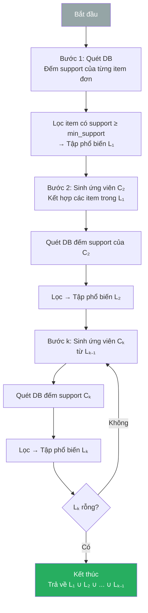
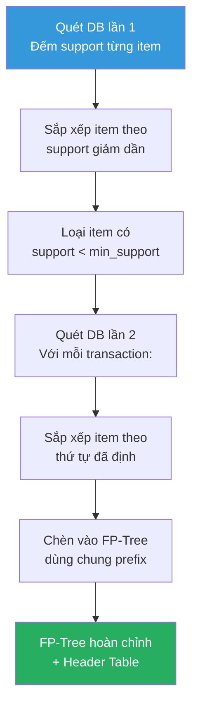
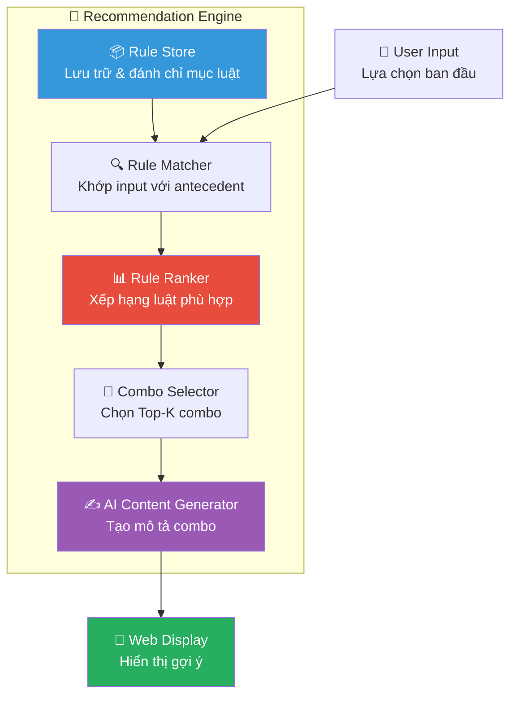
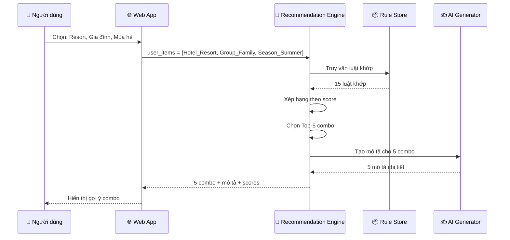
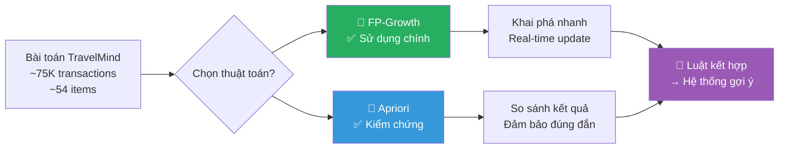

# 🧠 Thuật Toán & Mô Hình — TravelMind

> **Dự án:** TravelMind — Phân tích hành vi khách hàng ngành du lịch  
> **Phương pháp:** Khai phá Luật kết hợp (Association Rule Mining)  
> **Thuật toán:** Apriori & FP-Growth  
> **Thư viện:** `mlxtend` (Python)

---

## 1. Giới thiệu bài toán

### 1.1 Bài toán

Trong ngành du lịch — khách sạn, khách hàng thường đặt phòng kèm theo nhiều dịch vụ và tùy chọn khác nhau: loại phòng, bữa ăn, chỗ đỗ xe, kênh đặt phòng, v.v. Câu hỏi đặt ra là:

> **Những tổ hợp dịch vụ nào thường được đặt cùng nhau?**  
> Có thể dự đoán được khách hàng sẽ chọn dịch vụ gì dựa trên những gì họ đã chọn không?

### 1.2 Mục tiêu

- **Phát hiện các mẫu (pattern)** trong hành vi đặt phòng: những dịch vụ, tùy chọn nào thường xuất hiện cùng nhau.
- **Tạo ra các combo gợi ý** cho khách du lịch dựa trên các mẫu này.
- **Xây dựng hệ thống gợi ý thông minh** tích hợp vào nền tảng web TravelMind.

### 1.3 Cách tiếp cận

Chúng tôi sử dụng **Khai phá Luật kết hợp (Association Rule Mining)** — một kỹ thuật trong Khai phá Dữ liệu, nổi tiếng với bài toán "Giỏ hàng" (Market Basket Analysis):

- **Đầu vào:** Tập giao dịch (transaction dataset) — mỗi booking là 1 giao dịch chứa tập các item (features rời rạc hóa).
- **Đầu ra:** Các luật kết hợp dạng `{A, B} → {C, D}` với các chỉ số đánh giá (support, confidence, lift).
- **Ứng dụng:** Gợi ý combo du lịch, cross-selling dịch vụ, phân khúc khách hàng.


---

## 2. Cơ sở lý thuyết

### 2.1 Luật kết hợp (Association Rules)

#### Định nghĩa

Cho tập item $I = \{i_1, i_2, ..., i_n\}$ và cơ sở dữ liệu giao dịch $D = \{T_1, T_2, ..., T_N\}$ trong đó mỗi $T_k \subseteq I$.

Một **luật kết hợp** có dạng:

$$X \Rightarrow Y$$

trong đó $X, Y \subseteq I$ và $X \cap Y = \emptyset$.

- $X$ được gọi là **tiền đề** (antecedent / left-hand side)
- $Y$ được gọi là **hệ quả** (consequent / right-hand side)

#### Các chỉ số đánh giá

##### 📊 Support (Độ hỗ trợ)

$$\text{Support}(A) = \frac{|\{T \in D : A \subseteq T\}|}{|D|} = \frac{\text{count}(A)}{N}$$

$$\text{Support}(A \Rightarrow B) = \frac{|\{T \in D : A \cup B \subseteq T\}|}{|D|} = \frac{\text{count}(A \cup B)}{N}$$

**Ý nghĩa:** Tỷ lệ giao dịch chứa tập item $A$ (hoặc cả $A$ và $B$) trên tổng số giao dịch.

> **Ví dụ du lịch:**  
> Support({Hotel_Resort, Group_Family}) = 0.12  
> → 12% tổng số booking là gia đình đặt resort.

---

##### 🎯 Confidence (Độ tin cậy)

$$\text{Confidence}(A \Rightarrow B) = \frac{\text{Support}(A \cup B)}{\text{Support}(A)} = P(B|A)$$

**Ý nghĩa:** Xác suất có điều kiện — khi khách đã chọn $A$, khả năng họ cũng chọn $B$ là bao nhiêu?

> **Ví dụ du lịch:**  
> Confidence({Hotel_Resort, Group_Family} → {Meal_HB}) = 0.65  
> → 65% gia đình đặt resort cũng chọn bữa ăn Half Board.

---

##### 📈 Lift (Độ nâng)

$$\text{Lift}(A \Rightarrow B) = \frac{\text{Confidence}(A \Rightarrow B)}{\text{Support}(B)} = \frac{P(A \cup B)}{P(A) \cdot P(B)}$$

**Ý nghĩa:** Mức độ "bất ngờ" của luật so với ngẫu nhiên.

| Giá trị Lift | Diễn giải |
|---|---|
| Lift = 1 | A và B **độc lập** — không có mối liên hệ |
| Lift > 1 | A và B **tương quan thuận** — xuất hiện cùng nhau nhiều hơn kỳ vọng |
| Lift < 1 | A và B **tương quan nghịch** — ít xuất hiện cùng nhau |

> **Ví dụ du lịch:**  
> Lift({Hotel_Resort, Group_Family} → {Parking_Yes}) = 2.3  
> → Gia đình đặt resort có khả năng cần chỗ đỗ xe **gấp 2,3 lần** so với trung bình.

---

##### 📐 Conviction (Độ thuyết phục)

$$\text{Conviction}(A \Rightarrow B) = \frac{1 - \text{Support}(B)}{1 - \text{Confidence}(A \Rightarrow B)}$$

**Ý nghĩa:** Đo mức độ phụ thuộc hướng — conviction cao cho thấy B rất hay đi kèm A.

- Conviction = 1: A và B độc lập.
- Conviction → ∞: B luôn xuất hiện khi có A.

---

##### 📏 Leverage (Đòn bẩy)

$$\text{Leverage}(A \Rightarrow B) = \text{Support}(A \cup B) - \text{Support}(A) \times \text{Support}(B)$$

**Ý nghĩa:** Hiệu số giữa tần suất xuất hiện cùng thực tế và tần suất kỳ vọng nếu A, B độc lập.

- Leverage = 0: Độc lập.
- Leverage > 0: Có liên kết tích cực.

---

### 2.2 Thuật toán Apriori

#### Ý tưởng chính

Apriori dựa trên **nguyên lý Apriori** (Apriori Principle):

> *Nếu một tập item là không phổ biến (infrequent), thì mọi tập chứa nó cũng không phổ biến.*

Hay ngược lại: **Mọi tập con của tập phổ biến đều phổ biến.**

Nguyên lý này cho phép ta **cắt tỉa** (prune) không gian tìm kiếm một cách hiệu quả.

#### Quy trình từng bước



#### Chi tiết từng bước

**Bước 1 — Tìm tập phổ biến 1-item (L₁):**
- Quét toàn bộ cơ sở dữ liệu, đếm số lần xuất hiện của từng item đơn lẻ.
- Giữ lại các item có support ≥ `min_support`.

**Bước 2 — Sinh ứng viên (Candidate Generation):**
- Từ $L_{k-1}$, tạo tập ứng viên $C_k$ bằng cách ghép các tập phổ biến có $(k-2)$ item chung.
- **Cắt tỉa (Pruning):** Loại bỏ ứng viên nào có tập con $(k-1)$-item không nằm trong $L_{k-1}$.

**Bước 3 — Đếm support:**
- Quét lại cơ sở dữ liệu, đếm support cho từng ứng viên trong $C_k$.

**Bước 4 — Lọc:**
- Giữ lại ứng viên có support ≥ `min_support` → $L_k$.

**Lặp lại** cho đến khi $L_k = \emptyset$.

#### Mã giả (Pseudocode)

```
Algorithm: Apriori
Input: D (database), min_support
Output: L (all frequent itemsets)

1.  L₁ = {frequent 1-itemsets}
2.  for k = 2; L_{k-1} ≠ ∅; k++ do
3.      C_k = apriori_gen(L_{k-1})      // sinh ứng viên
4.      for each transaction t ∈ D do
5.          C_t = subset(C_k, t)          // tìm ứng viên có trong t
6.          for each candidate c ∈ C_t do
7.              c.count++
8.      L_k = {c ∈ C_k | c.count ≥ min_support × |D|}
9.  return L = ∪_k L_k
```

#### Phân tích độ phức tạp

| Yếu tố | Phân tích |
|---|---|
| **Thời gian** | $O(2^n)$ trong trường hợp xấu nhất (n = số item). Thực tế tốt hơn nhiều nhờ pruning |
| **Không gian** | Cần lưu trữ tập ứng viên $C_k$ trong bộ nhớ |
| **I/O** | Quét DB nhiều lần (k lần cho k-itemset lớn nhất) |

#### Ưu và nhược điểm

| Ưu điểm | Nhược điểm |
|---|---|
| ✅ Đơn giản, dễ hiểu và cài đặt | ❌ Sinh quá nhiều ứng viên (candidate explosion) |
| ✅ Nguyên lý cắt tỉa hiệu quả | ❌ Quét DB nhiều lần → chậm với DB lớn |
| ✅ Hoạt động tốt với min_support cao | ❌ Tốn bộ nhớ cho tập ứng viên |
| ✅ Được nghiên cứu kỹ, nhiều biến thể | ❌ Không phù hợp với dữ liệu chiều cao |

---

### 2.3 Thuật toán FP-Growth

#### Ý tưởng chính

FP-Growth (Frequent Pattern Growth) giải quyết nhược điểm chính của Apriori bằng cách:

1. **Không sinh ứng viên** — loại bỏ bước tốn kém nhất.
2. **Chỉ quét DB 2 lần** — thay vì k lần.
3. **Nén dữ liệu** vào cấu trúc FP-Tree — khai phá trực tiếp trên cây.

#### Quy trình từng bước

##### Giai đoạn 1: Xây dựng FP-Tree



**Bước 1 — Quét DB lần thứ nhất:**
- Đếm support của từng item đơn.
- Loại bỏ item không phổ biến (support < `min_support`).
- Sắp xếp các item phổ biến theo support **giảm dần**.

**Bước 2 — Quét DB lần thứ hai — Xây dựng FP-Tree:**
- Với mỗi giao dịch, sắp xếp các item (đã lọc) theo thứ tự ở Bước 1.
- Chèn vào cây:
  - Bắt đầu từ gốc (root).
  - Nếu nhánh đã tồn tại → tăng count.
  - Nếu chưa → tạo nhánh mới.
- Duy trì **Header Table** — liên kết (linked list) tất cả node cùng item.

##### Giai đoạn 2: Khai phá FP-Tree

**Bước 3 — Khai phá từ dưới lên (bottom-up):**

Với mỗi item $i$ trong Header Table (bắt đầu từ item có support thấp nhất):

1. Tìm tất cả **đường đi có điều kiện** (conditional pattern base) từ $i$ lên gốc.
2. Xây dựng **FP-Tree điều kiện** (conditional FP-Tree) cho $i$.
3. **Đệ quy** khai phá FP-Tree điều kiện.
4. Kết hợp kết quả để tạo tập phổ biến chứa $i$.

#### Ví dụ minh họa

Giả sử có 5 giao dịch đã sắp xếp:

| TID | Items (đã sắp xếp theo support giảm dần) |
|---|---|
| T1 | Hotel_City, Meal_BB, Dep_NoDeposit, Ch_OnlineTA |
| T2 | Hotel_City, Meal_BB, Dep_NoDeposit |
| T3 | Hotel_City, Meal_BB, Ch_OnlineTA |
| T4 | Hotel_Resort, Meal_HB, Parking_Yes |
| T5 | Hotel_City, Meal_BB, Dep_NoDeposit, Ch_OnlineTA, Parking_No |

FP-Tree sẽ nén T1, T2, T3, T5 vào cùng nhánh `Hotel_City → Meal_BB` (vì chung prefix), tiết kiệm bộ nhớ đáng kể.

#### Mã giả (Pseudocode)

```
Algorithm: FP-Growth
Input: D (database), min_support
Output: F (all frequent itemsets)

// Phase 1: Build FP-Tree
1.  Scan D, compute support of each item
2.  Remove infrequent items, sort by descending support
3.  Create root node of FP-Tree (null)
4.  For each transaction t in D:
5.      Sort items in t by the order in step 2
6.      Insert sorted items into FP-Tree
7.      Update Header Table links

// Phase 2: Mine FP-Tree
8.  Procedure FP-Growth(Tree, prefix α):
9.      For each item i in Header Table (ascending support):
10.         β = α ∪ {i}
11.         Add β to F with support = i.support
12.         Construct conditional pattern base for i
13.         Construct conditional FP-Tree (Tree_β)
14.         If Tree_β ≠ ∅ then
15.             FP-Growth(Tree_β, β)    // Đệ quy
```

#### So sánh FP-Growth vs Apriori

| Tiêu chí | Apriori | FP-Growth |
|---|---|---|
| **Sinh ứng viên** | Có — tốn kém | **Không** — khai phá trực tiếp |
| **Số lần quét DB** | k lần (k = itemset lớn nhất) | **2 lần** cố định |
| **Cấu trúc dữ liệu** | Bảng hash / mảng | **FP-Tree** (cây nén) |
| **Tốc độ** | Chậm hơn | **Nhanh hơn** (thường 10-100x) |
| **Bộ nhớ** | Tập ứng viên lớn | FP-Tree (thường nhỏ hơn) |
| **Min_support thấp** | Rất chậm (quá nhiều ứng viên) | **Xử lý tốt hơn** |
| **Khả năng mở rộng** | Kém với DB lớn | **Tốt hơn nhiều** |

> [!IMPORTANT]
> **Tại sao chúng tôi ưu tiên FP-Growth?**
> 
> Với bộ dữ liệu ~75.000 dòng × 15 features (~54 items unique), FP-Growth cho tốc độ nhanh hơn đáng kể so với Apriori do:
> 1. Không sinh ứng viên → tiết kiệm thời gian và bộ nhớ.
> 2. Chỉ quét DB 2 lần → giảm I/O.
> 3. FP-Tree nén hiệu quả các giao dịch có chung prefix (rất phổ biến trong dữ liệu khách sạn).
>
> Tuy nhiên, chúng tôi vẫn cài đặt cả Apriori để **so sánh kết quả** và **đảm bảo tính đúng đắn**.

---

## 3. Áp dụng vào dữ liệu

### 3.1 Cấu hình tham số

| Tham số | Giá trị | Lý do |
|---|---|---|
| `min_support` | **0.05** (5%) | Một pattern cần xuất hiện trong ít nhất 5% booking (~3.750 lần) để có ý nghĩa thống kê. Quá thấp → quá nhiều luật nhiễu; quá cao → bỏ sót pattern hữu ích. |
| `min_confidence` | **0.5** (50%) | Khi đã chọn X, xác suất cũng chọn Y phải ≥ 50% để luật đủ tin cậy cho gợi ý. |
| `min_lift` | **1.2** | Lift > 1.2 đảm bảo mối quan hệ giữa X và Y **mạnh hơn ngẫu nhiên** ít nhất 20%. Lift = 1 là hoàn toàn ngẫu nhiên. |
| **Thư viện** | `mlxtend` | Thư viện Python phổ biến, hỗ trợ cả Apriori và FP-Growth, tích hợp tốt với pandas. |

> [!NOTE]
> Các tham số trên có thể được tinh chỉnh sau khi phân tích kết quả ban đầu. Nếu quá ít luật → giảm min_support; quá nhiều luật → tăng min_confidence hoặc min_lift.

### 3.2 Quy trình thực hiện

#### Bước 1: Nạp Transaction Dataset

```python
import pandas as pd

# Nạp dữ liệu đã xử lý (output từ pipeline làm sạch)
# Đường dẫn tương đối từ thư mục backend/
df = pd.read_csv('backend/data/processed/transactions.csv')

# Danh sách cột feature
feature_cols = [
    'Hotel_Type', 'Meal_Type', 'Room_Type', 'Customer_Type',
    'Channel', 'Deposit', 'Group_Size', 'Season',
    'Price_Range', 'Lead_Time', 'Weekend_Stay', 'Weekday_Stay',
    'Special_Requests', 'Parking', 'Repeat_Guest'
]

# Tạo danh sách transaction
transactions = df[feature_cols].values.tolist()
print(f"Số giao dịch: {len(transactions)}")
print(f"Ví dụ: {transactions[0]}")
```

#### Bước 2: One-Hot Encoding

```python
from mlxtend.preprocessing import TransactionEncoder

te = TransactionEncoder()
te_array = te.fit(transactions).transform(transactions)
df_encoded = pd.DataFrame(te_array, columns=te.columns_)

print(f"Kích thước: {df_encoded.shape}")
# Kết quả kỳ vọng: (~75000, ~54)
print(f"Các cột: {list(df_encoded.columns[:10])}...")
```

#### Bước 3: Khai phá tập phổ biến

```python
from mlxtend.frequent_patterns import fpgrowth, apriori

# Phương pháp 1: FP-Growth (ưu tiên)
frequent_itemsets_fp = fpgrowth(
    df_encoded,
    min_support=0.05,
    use_colnames=True
)
print(f"Số tập phổ biến (FP-Growth): {len(frequent_itemsets_fp)}")

# Phương pháp 2: Apriori (để so sánh)
frequent_itemsets_ap = apriori(
    df_encoded,
    min_support=0.05,
    use_colnames=True
)
print(f"Số tập phổ biến (Apriori): {len(frequent_itemsets_ap)}")

# Kiểm tra kết quả giống nhau
assert len(frequent_itemsets_fp) == len(frequent_itemsets_ap), \
    "Kết quả hai thuật toán phải giống nhau!"
```

#### Bước 4: Sinh luật kết hợp

```python
from mlxtend.frequent_patterns import association_rules

rules = association_rules(
    frequent_itemsets_fp,
    metric="confidence",
    min_threshold=0.5
)

print(f"Tổng số luật (confidence ≥ 0.5): {len(rules)}")
print(rules.columns.tolist())
# ['antecedents', 'consequents', 'antecedent support', 'consequent support',
#  'support', 'confidence', 'lift', 'leverage', 'conviction', 'zhangs_metric']
```

#### Bước 5: Lọc theo Lift

```python
# Lọc luật có lift ≥ 1.2 (mạnh hơn ngẫu nhiên ít nhất 20%)
strong_rules = rules[rules['lift'] >= 1.2]

print(f"Số luật mạnh (lift ≥ 1.2): {len(strong_rules)}")
```

#### Bước 6: Sắp xếp và xếp hạng

```python
# Tạo cột score kết hợp = confidence × lift
strong_rules['score'] = strong_rules['confidence'] * strong_rules['lift']

# Sắp xếp theo score giảm dần
strong_rules = strong_rules.sort_values('score', ascending=False)

# Hiển thị top 20 luật
top_rules = strong_rules.head(20)
for idx, rule in top_rules.iterrows():
    ant = ', '.join(list(rule['antecedents']))
    con = ', '.join(list(rule['consequents']))
    print(f"  {ant}  →  {con}")
    print(f"    Support: {rule['support']:.3f} | "
          f"Confidence: {rule['confidence']:.3f} | "
          f"Lift: {rule['lift']:.2f} | "
          f"Score: {rule['score']:.3f}")
    print()
```

### 3.3 Ví dụ kết quả kỳ vọng

Dưới đây là các luật kết hợp **mẫu** mà chúng tôi kỳ vọng sẽ phát hiện được (dựa trên hiểu biết về miền khách sạn):

#### Luật 1: Gia đình đặt resort mùa hè

| Chỉ số | Giá trị |
|---|---|
| **Luật** | {Hotel_Resort, Group_Family, Season_Summer} → {Meal_HB, Parking_Yes} |
| **Support** | 0.062 |
| **Confidence** | 0.71 |
| **Lift** | 2.45 |
| **Diễn giải** | 71% gia đình đặt resort vào mùa hè cũng chọn Half Board và cần chỗ đỗ xe. Điều này hợp lý vì gia đình thường lái xe đến resort và muốn tiện lợi với bữa ăn kèm theo. |

#### Luật 2: Khách công tác đặt City Hotel

| Chỉ số | Giá trị |
|---|---|
| **Luật** | {Hotel_City, Cust_Transient, Ch_Corporate} → {Meal_BB, Dep_NoDeposit} |
| **Support** | 0.085 |
| **Confidence** | 0.68 |
| **Lift** | 1.82 |
| **Diễn giải** | 68% khách công tác đặt khách sạn thành phố chọn Bed & Breakfast và không đặt cọc. Khách công tác thường chỉ cần bữa sáng (ăn trưa/tối ở ngoài) và booking qua công ty nên không cần deposit. |

#### Luật 3: Khách đặt phút chót

| Chỉ số | Giá trị |
|---|---|
| **Luật** | {Lead_LastMinute, Ch_Direct} → {Weekend_Short, Price_Mid} |
| **Support** | 0.055 |
| **Confidence** | 0.58 |
| **Lift** | 1.65 |
| **Diễn giải** | 58% khách đặt phút chót qua kênh trực tiếp thường ở 1-2 đêm cuối tuần, mức giá trung bình. Đây là nhóm du lịch tự phát — "weekend getaway". |

#### Luật 4: Cặp đôi đặt resort mùa xuân

| Chỉ số | Giá trị |
|---|---|
| **Luật** | {Group_Couple, Hotel_Resort, Season_Spring} → {Meal_BB, Lead_Medium} |
| **Support** | 0.052 |
| **Confidence** | 0.63 |
| **Lift** | 1.78 |
| **Diễn giải** | 63% cặp đôi đặt resort mùa xuân chọn B&B và đặt trước 1-3 tháng. Cặp đôi thường lên kế hoạch trước cho kỳ nghỉ lãng mạn. |

#### Luật 5: Khách đi một mình đặt qua OTA

| Chỉ số | Giá trị |
|---|---|
| **Luật** | {Group_Solo, Ch_OnlineTA} → {Hotel_City, Price_Budget, Parking_No} |
| **Support** | 0.075 |
| **Confidence** | 0.61 |
| **Lift** | 1.53 |
| **Diễn giải** | 61% khách solo đặt qua OTA chọn City Hotel giá rẻ và không cần chỗ đỗ xe. Hợp lý vì khách solo thường di chuyển bằng phương tiện công cộng. |

#### Luật 6: Nhóm lớn đặt resort với nhiều yêu cầu

| Chỉ số | Giá trị |
|---|---|
| **Luật** | {Group_Large, Hotel_Resort} → {SpecReq_Few, Meal_HB} |
| **Support** | 0.051 |
| **Confidence** | 0.56 |
| **Lift** | 1.92 |
| **Diễn giải** | 56% nhóm lớn (3+ người lớn) đặt resort có yêu cầu đặc biệt và chọn Half Board. Nhóm đông thường có nhu cầu phức tạp hơn. |

#### Luật 7: Khách quay lại

| Chỉ số | Giá trị |
|---|---|
| **Luật** | {Repeat_Yes, Hotel_City} → {Dep_NoDeposit, Ch_Direct, Lead_Short} |
| **Support** | 0.053 |
| **Confidence** | 0.72 |
| **Lift** | 2.15 |
| **Diễn giải** | 72% khách quay lại đặt City Hotel không cần deposit, đặt trực tiếp và đặt ngắn hạn. Khách quen đã có niềm tin → đặt trực tiếp, không cần deposit, quyết định nhanh. |

#### Luật 8: Booking mùa đông

| Chỉ số | Giá trị |
|---|---|
| **Luật** | {Season_Winter, Hotel_City, Price_Premium} → {Meal_FB, Weekday_Medium} |
| **Support** | 0.058 |
| **Confidence** | 0.54 |
| **Lift** | 1.88 |
| **Diễn giải** | 54% booking mùa đông ở City Hotel phân khúc cao chọn Full Board và ở 3-5 đêm ngày thường. Có thể là khách du lịch mùa lễ hội, ở dài ngày và muốn trọn gói ăn uống. |

---

## 4. Từ luật kết hợp đến hệ thống gợi ý

### 4.1 Kiến trúc Recommendation Engine



### 4.2 Lưu trữ và đánh chỉ mục luật (Rule Store)

Sau khi khai phá, các luật kết hợp được lưu trữ dưới dạng cấu trúc dữ liệu có thể truy vấn nhanh:

```python
# Cấu trúc lưu trữ luật
rule_store = {
    'rules': [
        {
            'id': 'R001',
            'antecedent': frozenset({'Hotel_Resort', 'Group_Family', 'Season_Summer'}),
            'consequent': frozenset({'Meal_HB', 'Parking_Yes'}),
            'support': 0.062,
            'confidence': 0.71,
            'lift': 2.45,
            'score': 1.74  # confidence × lift
        },
        # ... thêm luật khác
    ]
}

# Đánh chỉ mục theo từng item trong antecedent
# để tìm kiếm nhanh khi user chọn item
index = {}
for rule in rule_store['rules']:
    for item in rule['antecedent']:
        if item not in index:
            index[item] = []
        index[item].append(rule['id'])
```

### 4.3 Khớp input với luật (Rule Matching)

Khi người dùng nhập các lựa chọn ban đầu, hệ thống tìm tất cả luật có antecedent **là tập con** của input:

```python
def match_rules(user_items: set, rule_store: list, min_match_ratio=0.5):
    """
    Tìm luật khớp với lựa chọn của người dùng.
    
    Args:
        user_items: Tập item người dùng đã chọn
        rule_store: Danh sách luật kết hợp
        min_match_ratio: Tỷ lệ khớp tối thiểu (mặc định 50%)
    
    Returns:
        Danh sách luật khớp, kèm mức độ khớp
    """
    matched = []
    for rule in rule_store:
        antecedent = rule['antecedent']
        # Số item trong antecedent mà user đã chọn
        overlap = antecedent & user_items
        match_ratio = len(overlap) / len(antecedent)
        
        if match_ratio >= min_match_ratio:
            matched.append({
                **rule,
                'match_ratio': match_ratio,
                'matched_items': overlap,
                'missing_items': antecedent - user_items
            })
    
    return matched
```

**Ví dụ:** Người dùng chọn `{Hotel_Resort, Group_Family}`:
- Luật `{Hotel_Resort, Group_Family, Season_Summer} → {Meal_HB, Parking_Yes}` khớp **2/3 = 67%** ✅
- Luật `{Hotel_City, Cust_Transient} → {Meal_BB}` khớp **0/2 = 0%** ❌

### 4.4 Xếp hạng luật (Rule Ranking)

Các luật khớp được xếp hạng theo **scoring formula**:

$$\text{Score}(rule) = \alpha \cdot \text{match\_ratio} + \beta \cdot \text{confidence} + \gamma \cdot \text{lift\_normalized}$$

Trong đó:
- $\alpha = 0.4$ — ưu tiên luật khớp nhiều item nhất
- $\beta = 0.35$ — ưu tiên luật có confidence cao
- $\gamma = 0.25$ — ưu tiên luật có lift cao (bất ngờ)

```python
def rank_rules(matched_rules: list) -> list:
    """Xếp hạng luật theo scoring formula."""
    max_lift = max(r['lift'] for r in matched_rules) if matched_rules else 1
    
    for rule in matched_rules:
        lift_norm = rule['lift'] / max_lift  # Chuẩn hóa lift về [0, 1]
        rule['final_score'] = (
            0.40 * rule['match_ratio'] +
            0.35 * rule['confidence'] +
            0.25 * lift_norm
        )
    
    return sorted(matched_rules, key=lambda r: r['final_score'], reverse=True)
```

### 4.5 Chọn Top-K Combo (Combo Selection)

```python
def select_top_combos(ranked_rules: list, top_k: int = 5) -> list:
    """
    Chọn top-K combo gợi ý, loại bỏ trùng lặp.
    """
    combos = []
    seen_consequents = set()
    
    for rule in ranked_rules:
        consequent_key = frozenset(rule['consequent'])
        if consequent_key not in seen_consequents:
            combos.append({
                'items': rule['antecedent'] | rule['consequent'],
                'antecedent': rule['antecedent'],
                'consequent': rule['consequent'],
                'confidence': rule['confidence'],
                'lift': rule['lift'],
                'score': rule['final_score']
            })
            seen_consequents.add(consequent_key)
        
        if len(combos) >= top_k:
            break
    
    return combos
```

### 4.6 AI Content Generator

Hệ thống sử dụng dữ liệu luật kết hợp để tự động tạo mô tả cho mỗi combo:

```python
def generate_combo_description(combo: dict) -> str:
    """
    Tạo mô tả hấp dẫn cho combo dựa trên luật kết hợp.
    
    Sử dụng template + rule data để tạo nội dung phù hợp.
    Có thể tích hợp LLM (Gemini API) cho mô tả tự nhiên hơn.
    """
    items = combo['items']
    confidence = combo['confidence']
    
    # Phân tích items để tạo mô tả
    hotel = next((i for i in items if i.startswith('Hotel_')), None)
    meal = next((i for i in items if i.startswith('Meal_')), None)
    group = next((i for i in items if i.startswith('Group_')), None)
    season = next((i for i in items if i.startswith('Season_')), None)
    price = next((i for i in items if i.startswith('Price_')), None)
    
    # Template-based generation
    description = f"Combo được {confidence*100:.0f}% khách hàng tương tự lựa chọn. "
    
    if hotel and 'Resort' in hotel:
        description += "Nghỉ dưỡng tại resort "
    elif hotel and 'City' in hotel:
        description += "Lưu trú tại khách sạn thành phố "
    
    if season:
        season_name = season.replace('Season_', '').lower()
        description += f"vào mùa {season_name}, "
    
    if meal:
        meal_desc = {
            'Meal_BB': 'kèm bữa sáng',
            'Meal_HB': 'kèm bữa sáng và tối',
            'Meal_FB': 'trọn gói 3 bữa ăn',
            'Meal_SC': 'tự phục vụ ăn uống'
        }
        description += meal_desc.get(meal, '') + ". "
    
    return description
```

### 4.7 Flow tổng hợp



---

## 5. Đánh giá mô hình

### 5.1 Đánh giá định lượng

#### Số lượng luật sinh ra

| Giai đoạn | Số lượng (ước tính) |
|---|---|
| Tập phổ biến (min_support = 0.05) | ~200–500 |
| Luật kết hợp (min_confidence = 0.5) | ~100–300 |
| Luật mạnh (min_lift = 1.2) | ~50–150 |
| Top luật (score cao nhất) | 20–50 |

#### Phân phối chỉ số

```python
import matplotlib.pyplot as plt

fig, axes = plt.subplots(1, 3, figsize=(15, 5))

# Phân phối Support
axes[0].hist(strong_rules['support'], bins=20, color='#3498db', edgecolor='white')
axes[0].set_title('Phân phối Support')
axes[0].set_xlabel('Support')
axes[0].set_ylabel('Số luật')

# Phân phối Confidence
axes[1].hist(strong_rules['confidence'], bins=20, color='#e74c3c', edgecolor='white')
axes[1].set_title('Phân phối Confidence')
axes[1].set_xlabel('Confidence')

# Phân phối Lift
axes[2].hist(strong_rules['lift'], bins=20, color='#27ae60', edgecolor='white')
axes[2].set_title('Phân phối Lift')
axes[2].set_xlabel('Lift')

plt.tight_layout()
# Lưu kết quả vào thư mục backend/reports/ (chạy từ thư mục gốc DAMH/)
plt.savefig('backend/reports/rule_distribution.png', dpi=150)
plt.show()
```

### 5.2 Đánh giá Coverage (Độ phủ)

```python
def calculate_coverage(rules, df_encoded):
    """
    Tính % giao dịch được "phủ" bởi ít nhất 1 luật.
    """
    covered = set()
    
    for _, rule in rules.iterrows():
        antecedent = list(rule['antecedents'])
        # Tìm giao dịch chứa tất cả item trong antecedent
        mask = df_encoded[antecedent].all(axis=1)
        covered.update(mask[mask].index.tolist())
    
    coverage = len(covered) / len(df_encoded) * 100
    return coverage

coverage = calculate_coverage(strong_rules, df_encoded)
print(f"Coverage: {coverage:.1f}% giao dịch được phủ bởi ít nhất 1 luật")
# Kỳ vọng: 60-80%
```

**Diễn giải Coverage:**
- **> 70%**: Tốt — hệ thống có thể gợi ý cho phần lớn khách hàng.
- **50-70%**: Chấp nhận được — cần bổ sung chiến lược cho nhóm không được phủ.
- **< 50%**: Cần xem xét lại tham số hoặc bổ sung features.

### 5.3 Đánh giá nghiệp vụ (Business Evaluation)

| Tiêu chí | Câu hỏi kiểm tra | Phương pháp |
|---|---|---|
| **Tính hợp lý** | Luật có phù hợp với hiểu biết nghiệp vụ không? | Chuyên gia du lịch review top 20 luật |
| **Tính hữu ích** | Combo gợi ý có giá trị cho khách hàng không? | Đánh giá chủ quan |
| **Tính đa dạng** | Các combo có đa dạng hay chỉ xoay quanh vài pattern? | Kiểm tra phân phối items trong combo |
| **Tính bất ngờ** | Có phát hiện được mối quan hệ mới, không hiển nhiên không? | Luật có Lift cao nhưng Confidence vừa phải |

> [!TIP]
> Luật tốt nhất không nhất thiết là luật có confidence cao nhất (có thể quá hiển nhiên), mà là luật có **lift cao** (bất ngờ) kết hợp **confidence đủ** (đáng tin cậy).

---

## 6. So sánh Apriori vs FP-Growth

### 6.1 Bảng so sánh hiệu năng

| Tiêu chí | Apriori | FP-Growth | Ghi chú |
|---|---|---|---|
| **Thời gian chạy** | ~15–30 giây | ~2–5 giây | FP-Growth nhanh hơn **5-10x** |
| **Bộ nhớ sử dụng** | ~500 MB (tập ứng viên lớn) | ~200 MB (FP-Tree nén) | FP-Growth tiết kiệm hơn |
| **Số lần quét DB** | k lần (k = max itemset size) | 2 lần cố định | FP-Growth ổn định hơn |
| **Số tập phổ biến** | Giống nhau | Giống nhau | Kết quả **hoàn toàn giống nhau** |
| **Số luật sinh ra** | Giống nhau | Giống nhau | Đảm bảo tính đúng đắn |
| **Min_support thấp** | Rất chậm | Vẫn nhanh | FP-Growth vượt trội |
| **Dễ cài đặt** | ⭐⭐⭐⭐⭐ | ⭐⭐⭐ | Apriori đơn giản hơn |
| **Khả năng debug** | Dễ (từng bước) | Khó hơn (cây + đệ quy) | Apriori trực quan hơn |

### 6.2 Đo benchmark trên bộ dữ liệu TravelMind

```python
import time

# Benchmark Apriori
start = time.time()
freq_ap = apriori(df_encoded, min_support=0.05, use_colnames=True)
time_apriori = time.time() - start

# Benchmark FP-Growth
start = time.time()
freq_fp = fpgrowth(df_encoded, min_support=0.05, use_colnames=True)
time_fpgrowth = time.time() - start

print(f"Apriori:   {time_apriori:.2f}s | {len(freq_ap)} tập phổ biến")
print(f"FP-Growth: {time_fpgrowth:.2f}s | {len(freq_fp)} tập phổ biến")
print(f"Tốc độ: FP-Growth nhanh hơn {time_apriori/time_fpgrowth:.1f}x")
```

### 6.3 Kết luận



> [!IMPORTANT]
> **Quyết định cuối cùng:**
> - **FP-Growth** là thuật toán chính cho hệ thống production — tốc độ nhanh, phù hợp cho cập nhật và tương tác real-time.
> - **Apriori** được giữ lại trong pipeline để **cross-validate** kết quả — đảm bảo hai thuật toán cho kết quả giống nhau.

---

> **Tài liệu trước:** [02_lam_sach_du_lieu.md](./02_lam_sach_du_lieu.md) — Làm sạch & Tăng cường dữ liệu  
> **Tài liệu tiếp theo:** [04_kien_truc_he_thong.md](./04_kien_truc_he_thong.md) — Kiến trúc hệ thống Decoupled  
> **Triển khai thuật toán:** `backend/app/services/mining_service.py`
