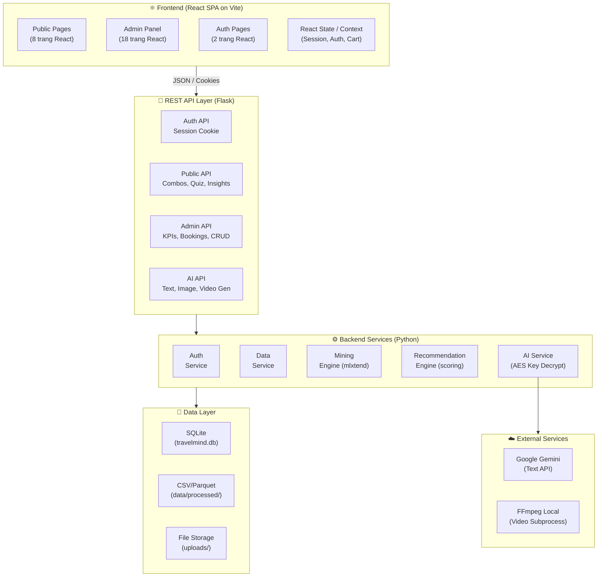
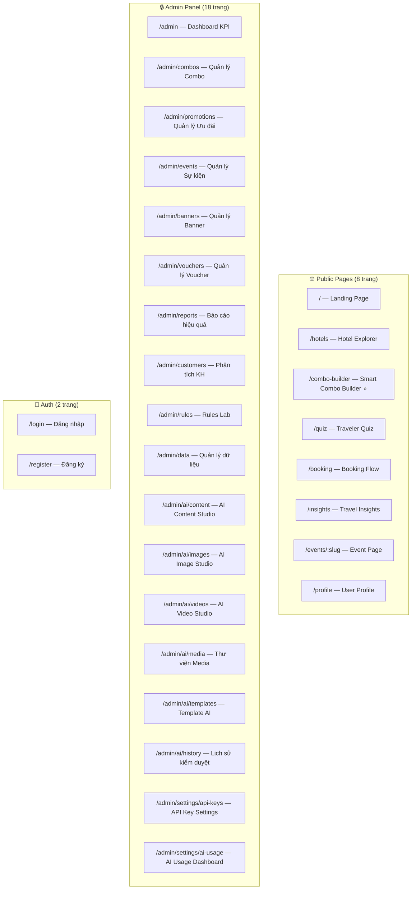
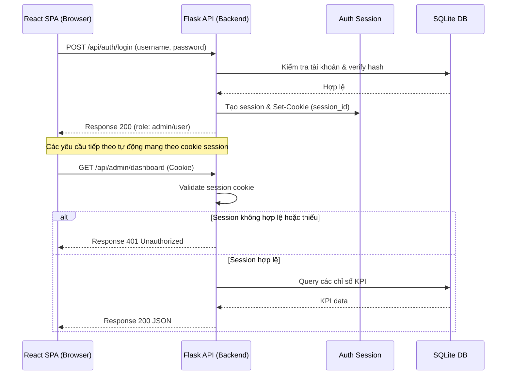
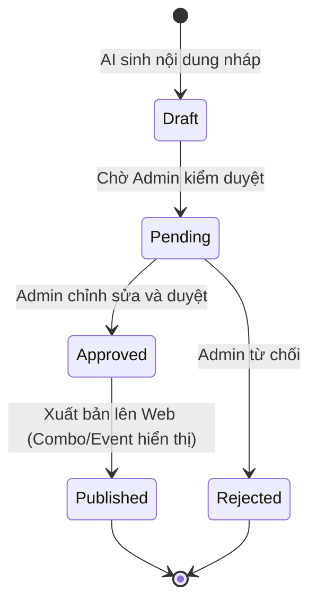

# 📐 Kiến Trúc Hệ Thống TravelMind (Decoupled)

> Tài liệu mô tả kiến trúc tổng thể, các thành phần, luồng dữ liệu, phân chia thư mục và thiết kế kỹ thuật của hệ thống TravelMind theo mô hình decoupled (API Backend và SPA Frontend).

---

## 1. Tổng Quan Kiến Trúc

### 1.1 Sơ đồ kiến trúc tổng thể



### 1.2 Kiến trúc phân lớp và phân vai công nghệ

| Lớp | Công nghệ | Vai trò |
|---|---|---|
| **Presentation (Frontend)** | React 18, Vite, React Router, Plotly.js, Chart.js | Single Page Application, vẽ biểu đồ tương tác |
| **Styling (CSS)** | CSS Modules / Vanilla CSS | Xây dựng giao diện kính mờ (Glassmorphism), vi hoạt ảnh |
| **API Gateway (Backend)** | Flask, Flask-CORS, Flask-Login | Định tuyến, quản lý phiên qua cookie, kiểm tra quyền |
| **Business Logic** | Python modules (mlxtend, pandas, numpy) | Chạy Apriori/FP-Growth, tính toán score gợi ý |
| **Data Access** | SQLAlchemy 2.0 ORM | Truy xuất và cập nhật SQLite database |
| **Storage** | SQLite, File System | Lưu trữ thông tin nghiệp vụ và tệp tin media |
| **External APIs** | requests (Gemini API), subprocess (FFmpeg) | Sinh văn bản quảng cáo và ghép slideshow video |

---

## 2. Kiến Trúc Frontend (React SPA)

### 2.1 Công nghệ cốt lõi

- **Framework & Build tool:** React 18 + Vite (đảm bảo hot-reload cực nhanh và dung lượng build tối ưu).
- **Routing:** React Router v6 (quản lý URL, phân chia các route Công khai và Bảo mật Admin).
- **State Management:** React Context (quản lý trạng thái đăng nhập `AuthContext`, giỏ hàng hoặc thông tin combo).
- **Biểu đồ:** `react-chartjs-2` (cho Chart.js), `plotly.js-dist-min` (cho bản đồ và heatmap tương tác).
- **Styling:** CSS Modules giúp tránh chồng chéo class CSS, hỗ trợ hiệu ứng kính mờ (Glassmorphism) và dark-mode hiện đại.

### 2.2 Cấu trúc trang (28 trang)



---

## 3. Kiến Trúc Backend (Flask API Only)

### 3.1 Thiết kế API

Flask đóng vai trò là một **REST API Server** thuần túy:
- Không render giao diện qua Jinja2 templates.
- Trả về dữ liệu kiểu JSON cho mọi API.
- Cấu hình CORS để chấp nhận kết nối từ `http://localhost:5173` (Vite dev server) kèm theo cookie phiên (`credentials: 'include'`).

### 3.2 Luồng xử lý yêu cầu (CORS & Cookies)



---

## 4. Tích Hợp AI & Quản Lý Khóa API

### 4.1 Luồng sinh và duyệt nội dung AI (Moderation Workflow)

Tất cả văn bản được tạo bởi Gemini LLM hoặc hình ảnh được tạo từ Image Gen API đều đi qua hàng đợi duyệt trên database trước khi hiển thị phía công khai:



### 4.2 Bảo mật Khóa API
- Khóa API được Admin nhập trực tiếp trên trang `/admin/settings/api-keys`.
- Backend Flask dùng thư viện `cryptography` giải mã khóa `AI_ENCRYPTION_KEY` trong file `.env`, sau đó mã hóa khóa API của nhà cung cấp dưới thuật toán **AES-256 (Fernet)** trước khi ghi xuống bảng `ai_providers`.
- Khi thực hiện cuộc gọi API đến Gemini, backend giải mã tạm thời khóa trong bộ nhớ, thực hiện cuộc gọi, và lập tức xóa khóa khỏi memory.

---

## 5. Cấu Trúc Thư Mục Dự Án

```
DAMH/
├── backend/                      # 🔌 Flask Backend API
│   ├── app/
│   │   ├── __init__.py           # Khởi tạo App, CORS, Blueprints
│   │   ├── config.py             # Cấu hình app (Dev, Prod, SQLite path)
│   │   ├── extensions.py         # SQLAlchemy, LoginManager, CORS
│   │   │
│   │   ├── models/               # Các Model SQLAlchemy
│   │   │   ├── __init__.py
│   │   │   ├── user.py
│   │   │   ├── booking.py
│   │   │   ├── user_booking.py   # Web bookings (27 cột)
│   │   │   ├── data_source.py
│   │   │   ├── rule.py           # configs & rules
│   │   │   ├── combo.py
│   │   │   ├── promotion.py
│   │   │   ├── event.py
│   │   │   ├── banner.py
│   │   │   ├── voucher.py
│   │   │   ├── ai_provider.py
│   │   │   ├── ai_content.py
│   │   │   ├── ai_media.py
│   │   │   ├── ai_template.py
│   │   │   ├── ai_usage.py
│   │   │   └── quiz_result.py
│   │   │
│   │   ├── routes/               # API endpoints
│   │   │   ├── __init__.py
│   │   │   ├── auth.py
│   │   │   ├── public.py
│   │   │   ├── admin_data.py
│   │   │   ├── admin_mining.py
│   │   │   ├── admin_business.py
│   │   │   ├── admin_ai.py
│   │   │   └── admin_settings.py
│   │   │
│   │   └── services/             # Core logic services
│   │       ├── __init__.py
│   │       ├── auth_service.py
│   │       ├── data_service.py
│   │       ├── mining_service.py
│   │       ├── recommendation_service.py
│   │       ├── ai_text_service.py
│   │       ├── ai_image_service.py
│   │       ├── ai_video_service.py
│   │       └── ai_key_service.py
│   │
│   ├── data/
│   │   ├── raw/                  # hotel_bookings.csv
│   │   └── processed/            # cleaned_bookings.csv, transactions.csv
│   │
│   ├── scripts/                  # Scripts khởi động và chạy nền
│   │   ├── import_data.py
│   │   ├── clean_data.py
│   │   ├── run_mining.py
│   │   └── seed_admin.py
│   │
│   ├── requirements.txt
│   ├── run.py                    # Chạy backend (localhost:5000)
│   └── .env
│
└── frontend/                     # ⚛️ React Frontend (Vite)
    ├── src/
    │   ├── assets/               # CSS global, ảnh nền, logo
    │   ├── components/           # UI components (GlassCard, Nav, Sidebar)
    │   ├── pages/                # 28 pages as React components
    │   │   ├── public/           # Landing, Explorer, Builder, Quiz, Booking, Insights
    │   │   ├── admin/            # Dashboard, CRUD managers, AI Studios, Settings
    │   │   └── auth/             # Login, Register
    │   ├── services/             # Axios/fetch API wrappers
    │   ├── styles/               # CSS Modules tương ứng cho từng component/page
    │   ├── App.jsx               # React Router & Context providers
    │   └── main.jsx
    ├── package.json
    ├── vite.config.js            # Proxy `/api` -> `localhost:5000`
    └── index.html
```

---

## 6. Hướng Dẫn Triển Khai & Khởi Chạy

### 6.1 Yêu cầu hệ thống
- **Python:** 3.10+
- **Node.js:** 18+ (npm 9+)
- **FFmpeg:** Phải được cài đặt trên máy và thêm vào biến môi trường `PATH` (để chạy sinh video cục bộ).

### 6.2 Khởi chạy Backend
1. Di chuyển vào thư mục backend và cài đặt môi trường ảo:
   ```bash
   cd backend
   python -m venv venv
   # Kích hoạt trên Windows:
   venv\Scripts\activate
   # Kích hoạt trên macOS/Linux:
   source venv/bin/activate
   ```
2. Cài đặt các thư viện dependencies:
   ```bash
   pip install -r requirements.txt
   ```
3. Tạo file cấu hình `.env` dựa trên file `.env.example` và thiết lập khóa mã hóa:
   ```env
   SECRET_KEY=yoursecretkey
   AI_ENCRYPTION_KEY=FernetKeyGeneratedBase64
   FLASK_ENV=development
   ```
4. Khởi chạy các script nạp và dọn dẹp dữ liệu ban đầu:
   ```bash
   python scripts/import_data.py
   python scripts/seed_admin.py
   ```
5. Chạy server Flask API:
   ```bash
   python run.py
   # Chạy trên cổng 5000
   ```

### 6.3 Khởi chạy Frontend React
1. Mở terminal mới, di chuyển đến thư mục frontend và cài đặt thư viện:
   ```bash
   cd frontend
   npm install
   ```
2. Khởi động server phát triển Vite:
   ```bash
   npm run dev
   # Mở trình duyệt truy cập: http://localhost:5173
   ```
3. Khi React gửi yêu cầu tới các API có dạng `/api/*`, Vite sẽ tự động proxy yêu cầu sang backend cổng `5000` mà không bị lỗi CORS.
