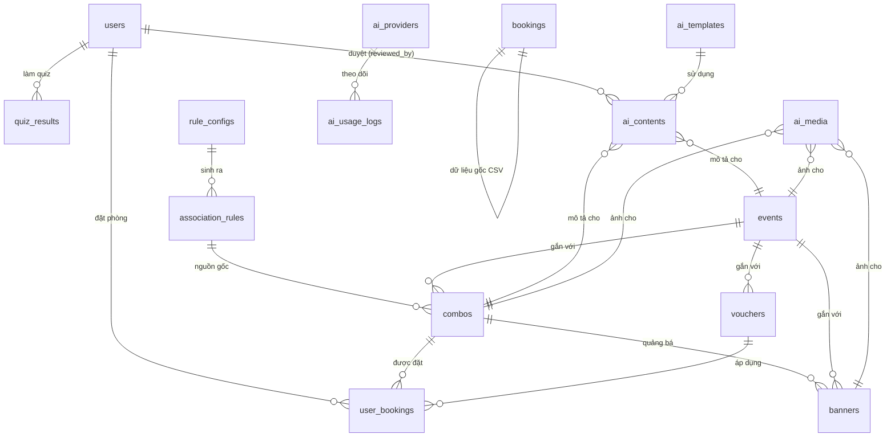
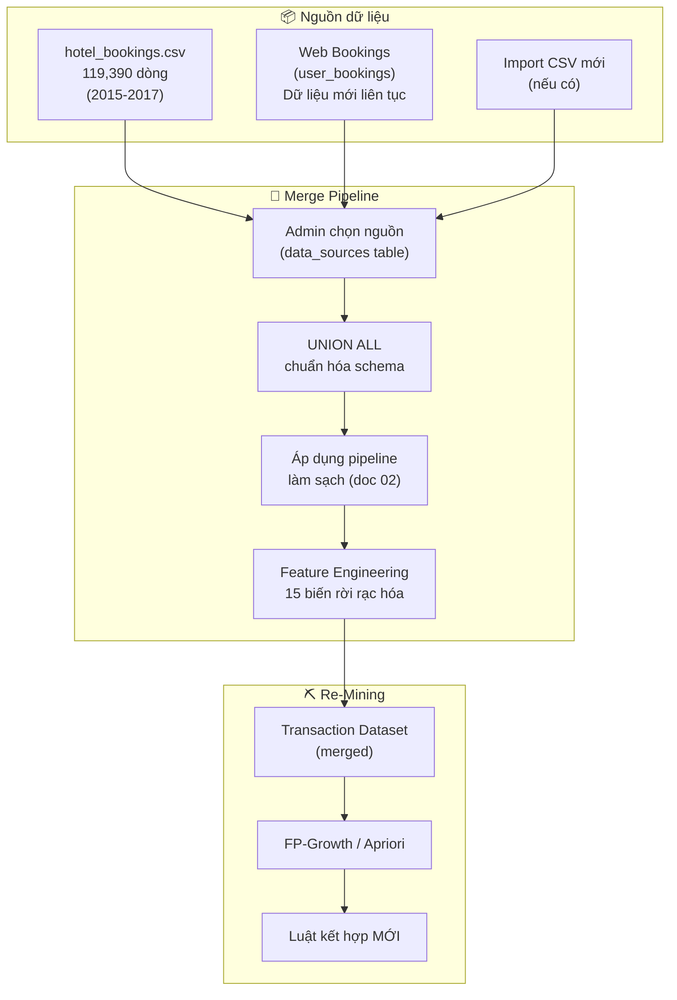

# 💾 Thiết Kế Cơ Sở Dữ Liệu — TravelMind

> Tài liệu mô tả chi tiết schema database, các bảng, mối quan hệ và chiến lược tối ưu.

---

## 1. Tổng Quan

| Thuộc tính | Giá trị |
|---|---|
| **Database Engine** | SQLite 3 |
| **ORM** | SQLAlchemy 2.0 |
| **Lý do chọn SQLite** | Nhẹ, không cần server riêng, dễ triển khai, đủ cho đồ án |
| **Số bảng** | 17 bảng |
| **File database** | `backend/instance/travelmind.db` |

---

## 2. Sơ Đồ Quan Hệ Tổng Thể (ER Diagram)



---

## 3. Chi Tiết Từng Bảng

### 3.1 `users` — Người dùng

| Cột | Kiểu | Ràng buộc | Mô tả |
|---|---|---|---|
| `id` | INTEGER | PK, AUTO | Mã người dùng |
| `username` | VARCHAR(80) | UNIQUE, NOT NULL | Tên đăng nhập |
| `email` | VARCHAR(120) | UNIQUE, NOT NULL | Email |
| `password_hash` | VARCHAR(256) | NOT NULL | Mật khẩu đã hash (pbkdf2:sha256) |
| `full_name` | VARCHAR(100) | | Họ tên đầy đủ |
| `role` | VARCHAR(20) | NOT NULL, DEFAULT 'user' | `user` hoặc `admin` |
| `is_active` | BOOLEAN | DEFAULT TRUE | Tài khoản hoạt động? |
| `created_at` | DATETIME | DEFAULT NOW | Ngày tạo |
| `updated_at` | DATETIME | | Ngày cập nhật |

```python
# File: backend/app/models/user.py
class User(db.Model):
    __tablename__ = 'users'
    id = db.Column(db.Integer, primary_key=True)
    username = db.Column(db.String(80), unique=True, nullable=False)
    email = db.Column(db.String(120), unique=True, nullable=False)
    password_hash = db.Column(db.String(256), nullable=False)
    full_name = db.Column(db.String(100))
    role = db.Column(db.String(20), nullable=False, default='user')
    is_active = db.Column(db.Boolean, default=True)
    created_at = db.Column(db.DateTime, default=datetime.utcnow)
    updated_at = db.Column(db.DateTime, onupdate=datetime.utcnow)
```

---

### 3.2 `bookings` — Dữ liệu đặt phòng (import từ CSV)

| Cột | Kiểu | Mô tả |
|---|---|---|
| `id` | INTEGER | PK, AUTO |
| `hotel` | VARCHAR(20) | Resort Hotel / City Hotel |
| `is_canceled` | INTEGER | 0 = không hủy, 1 = đã hủy |
| `lead_time` | INTEGER | Số ngày đặt trước |
| `arrival_date_year` | INTEGER | Năm đến (2015-2017) |
| `arrival_date_month` | VARCHAR(20) | Tháng đến |
| `arrival_date_week_number` | INTEGER | Tuần trong năm |
| `arrival_date_day_of_month` | INTEGER | Ngày trong tháng |
| `stays_in_weekend_nights` | INTEGER | Số đêm cuối tuần |
| `stays_in_week_nights` | INTEGER | Số đêm trong tuần |
| `adults` | INTEGER | Số người lớn |
| `children` | INTEGER | Số trẻ em |
| `babies` | INTEGER | Số em bé |
| `meal` | VARCHAR(10) | BB/HB/FB/SC |
| `country` | VARCHAR(5) | Mã ISO quốc gia |
| `market_segment` | VARCHAR(20) | Phân khúc thị trường |
| `distribution_channel` | VARCHAR(20) | Kênh phân phối |
| `is_repeated_guest` | INTEGER | 0/1 |
| `previous_cancellations` | INTEGER | Số lần hủy trước |
| `previous_bookings_not_canceled` | INTEGER | Số lần đặt thành công trước |
| `reserved_room_type` | VARCHAR(5) | Loại phòng đặt |
| `assigned_room_type` | VARCHAR(5) | Loại phòng được gán |
| `booking_changes` | INTEGER | Số lần thay đổi |
| `deposit_type` | VARCHAR(20) | Loại đặt cọc |
| `agent` | INTEGER | Mã đại lý (NULL = không qua đại lý) |
| `days_in_waiting_list` | INTEGER | Số ngày chờ |
| `customer_type` | VARCHAR(20) | Loại khách hàng |
| `adr` | FLOAT | Giá trung bình/đêm ($) |
| `required_car_parking_spaces` | INTEGER | Số chỗ đỗ xe |
| `total_of_special_requests` | INTEGER | Số yêu cầu đặc biệt |
| `reservation_status` | VARCHAR(20) | Check-Out/Canceled/No-Show |
| `reservation_status_date` | DATE | Ngày cập nhật trạng thái |

> [!NOTE]
> Bảng này import 1-1 từ `hotel_bookings.csv`. Cột `company` đã bị loại bỏ (94% thiếu).

---

### 3.3 `rule_configs` — Cấu hình chạy thuật toán

| Cột | Kiểu | Mô tả |
|---|---|---|
| `id` | INTEGER | PK, AUTO |
| `algorithm` | VARCHAR(20) | `apriori` hoặc `fpgrowth` |
| `min_support` | FLOAT | Ngưỡng support tối thiểu |
| `min_confidence` | FLOAT | Ngưỡng confidence tối thiểu |
| `min_lift` | FLOAT | Ngưỡng lift tối thiểu |
| `features_used` | JSON | Danh sách features đưa vào |
| `only_successful` | BOOLEAN | Chỉ dùng booking thành công? |
| `total_transactions` | INTEGER | Số giao dịch đầu vào |
| `total_rules_generated` | INTEGER | Tổng số luật sinh ra |
| `execution_time_seconds` | FLOAT | Thời gian chạy |
| `created_at` | DATETIME | Ngày chạy |
| `created_by` | INTEGER | FK → `users.id` |

---

### 3.4 `association_rules` — Luật kết hợp

| Cột | Kiểu | Mô tả |
|---|---|---|
| `id` | INTEGER | PK, AUTO |
| `config_id` | INTEGER | FK → `rule_configs.id` |
| `antecedent` | JSON | Tập tiền đề, VD: `["Hotel_Resort","Group_Family"]` |
| `consequent` | JSON | Tập kết quả, VD: `["Meal_HB","Parking_Yes"]` |
| `support` | FLOAT | Độ hỗ trợ |
| `confidence` | FLOAT | Độ tin cậy |
| `lift` | FLOAT | Độ nâng |
| `conviction` | FLOAT | Độ thuyết phục |
| `leverage` | FLOAT | Đòn bẩy |
| `antecedent_support` | FLOAT | Support của antecedent |
| `consequent_support` | FLOAT | Support của consequent |
| `rule_hash` | VARCHAR(64) | Hash duy nhất của luật (để tránh trùng) |
| `created_at` | DATETIME | Ngày tạo |

---

### 3.5 `combos` — Gói combo du lịch

| Cột | Kiểu | Mô tả |
|---|---|---|
| `id` | INTEGER | PK, AUTO |
| `name` | VARCHAR(100) | Tên combo |
| `slug` | VARCHAR(100) | URL slug |
| `short_description` | TEXT | Mô tả ngắn |
| `full_description` | TEXT | Mô tả chi tiết (có thể từ AI) |
| `services` | JSON | Danh sách dịch vụ, VD: `["Resort","HB","Room_D","Parking"]` |
| `source_rule_id` | INTEGER | FK → `association_rules.id` |
| `match_confidence` | FLOAT | Confidence của luật gốc |
| `match_lift` | FLOAT | Lift của luật gốc |
| `price_estimate` | FLOAT | Giá ước tính ($/đêm) |
| `discount_percent` | FLOAT | % giảm giá (nếu có) |
| `discount_description` | TEXT | Mô tả ưu đãi |
| `target_group` | VARCHAR(20) | Solo/Couple/Family/Large |
| `target_season` | VARCHAR(20) | Spring/Summer/Autumn/Winter |
| `event_id` | INTEGER | FK → `events.id` (nullable) |
| `image_url` | VARCHAR(255) | URL ảnh combo |
| `is_active` | BOOLEAN | Đang hiển thị? |
| `display_order` | INTEGER | Thứ tự hiển thị |
| `total_bookings` | INTEGER | Số lượt đặt (demo) |
| `created_at` | DATETIME | |
| `updated_at` | DATETIME | |

---

### 3.6 `promotions` — Gói ưu đãi

| Cột | Kiểu | Mô tả |
|---|---|---|
| `id` | INTEGER | PK, AUTO |
| `name` | VARCHAR(100) | Tên ưu đãi |
| `description` | TEXT | Mô tả chi tiết |
| `discount_type` | VARCHAR(20) | `percent` / `fixed` / `free_service` |
| `discount_value` | FLOAT | Giá trị giảm |
| `apply_to` | VARCHAR(50) | Áp dụng cho dịch vụ nào |
| `conditions` | JSON | Điều kiện: `{"hotel":"Resort","group":"Family",...}` |
| `target_segment` | JSON | Phân khúc mục tiêu |
| `start_date` | DATE | Ngày bắt đầu |
| `end_date` | DATE | Ngày kết thúc |
| `is_active` | BOOLEAN | Đang hoạt động? |
| `source_insight` | TEXT | Insight từ data (lý do tạo) |
| `expected_revenue` | FLOAT | Doanh thu kỳ vọng |
| `created_at` | DATETIME | |

---

### 3.7 `events` — Sự kiện / Chiến dịch

| Cột | Kiểu | Mô tả |
|---|---|---|
| `id` | INTEGER | PK, AUTO |
| `name` | VARCHAR(100) | Tên sự kiện |
| `slug` | VARCHAR(100) | URL slug |
| `description` | TEXT | Mô tả (có thể từ AI) |
| `start_date` | DATE | Ngày bắt đầu |
| `end_date` | DATE | Ngày kết thúc |
| `target_audience` | JSON | Đối tượng mục tiêu |
| `is_active` | BOOLEAN | |
| `created_at` | DATETIME | |
| `updated_at` | DATETIME | |

---

### 3.8 `banners` — Banner quảng cáo

| Cột | Kiểu | Mô tả |
|---|---|---|
| `id` | INTEGER | PK, AUTO |
| `title` | VARCHAR(100) | Headline |
| `subtitle` | VARCHAR(200) | Tagline |
| `cta_text` | VARCHAR(50) | Text nút CTA |
| `cta_link` | VARCHAR(255) | Link đích |
| `image_url` | VARCHAR(255) | URL ảnh banner |
| `position` | VARCHAR(20) | `hero` / `sidebar` / `popup` / `footer` |
| `display_order` | INTEGER | Thứ tự hiển thị |
| `start_date` | DATE | |
| `end_date` | DATE | |
| `event_id` | INTEGER | FK → `events.id` (nullable) |
| `combo_id` | INTEGER | FK → `combos.id` (nullable) |
| `is_active` | BOOLEAN | |
| `created_at` | DATETIME | |

---

### 3.9 `vouchers` — Mã giảm giá

| Cột | Kiểu | Mô tả |
|---|---|---|
| `id` | INTEGER | PK, AUTO |
| `code` | VARCHAR(20) | Mã voucher (UNIQUE) |
| `description` | TEXT | Mô tả |
| `discount_type` | VARCHAR(20) | `percent` / `fixed` |
| `discount_value` | FLOAT | Giá trị giảm |
| `max_discount` | FLOAT | Giảm tối đa ($) |
| `min_booking_value` | FLOAT | Giá trị đặt tối thiểu |
| `conditions` | JSON | Điều kiện áp dụng |
| `total_quantity` | INTEGER | Tổng số lượng |
| `used_count` | INTEGER | Đã sử dụng |
| `max_per_user` | INTEGER | Mỗi user dùng tối đa |
| `expiry_date` | DATE | Ngày hết hạn |
| `event_id` | INTEGER | FK → `events.id` (nullable) |
| `combo_id` | INTEGER | FK → `combos.id` (nullable) |
| `is_active` | BOOLEAN | |
| `created_at` | DATETIME | |

---

### 3.10 `ai_providers` — Cấu hình AI Provider

| Cột | Kiểu | Mô tả |
|---|---|---|
| `id` | INTEGER | PK, AUTO |
| `service_type` | VARCHAR(20) | `text` / `image` / `video` |
| `provider_name` | VARCHAR(50) | `gemini` / `openai` / `stability` / `ffmpeg` |
| `api_key_encrypted` | TEXT | API key đã mã hóa AES-256 |
| `model_name` | VARCHAR(100) | Model name |
| `endpoint_url` | VARCHAR(255) | Custom endpoint (nullable) |
| `is_active` | BOOLEAN | |
| `monthly_limit_usd` | FLOAT | Giới hạn chi phí/tháng |
| `created_at` | DATETIME | |
| `updated_at` | DATETIME | |

---

### 3.11 `ai_contents` — Nội dung AI sinh ra

| Cột | Kiểu | Mô tả |
|---|---|---|
| `id` | INTEGER | PK, AUTO |
| `content_type` | VARCHAR(30) | `combo_desc` / `event_desc` / `banner_text` / `voucher_desc` / `email` / `personal_advice` / `insight_report` |
| `target_type` | VARCHAR(20) | `combo` / `event` / `banner` / `voucher` |
| `target_id` | INTEGER | ID của đối tượng target |
| `template_id` | INTEGER | FK → `ai_templates.id` |
| `prompt_used` | TEXT | Prompt đã gửi cho AI |
| `generated_text` | JSON | Kết quả (nhiều phiên bản) |
| `selected_version` | INTEGER | Phiên bản được chọn |
| `edited_text` | TEXT | Nội dung sau khi admin sửa |
| `status` | VARCHAR(20) | `draft` / `pending` / `approved` / `published` / `rejected` / `revision` |
| `admin_note` | TEXT | Ghi chú của admin |
| `reviewed_by` | INTEGER | FK → `users.id` |
| `created_at` | DATETIME | |
| `reviewed_at` | DATETIME | |
| `published_at` | DATETIME | |

---

### 3.12 `ai_templates` — Template prompt

| Cột | Kiểu | Mô tả |
|---|---|---|
| `id` | INTEGER | PK, AUTO |
| `name` | VARCHAR(100) | Tên template |
| `content_type` | VARCHAR(30) | Áp dụng cho loại nội dung nào |
| `language` | VARCHAR(5) | `vi` / `en` |
| `prompt_template` | TEXT | Template prompt (có `{variables}`) |
| `variables` | JSON | Danh sách biến: `["services","target_group",...]` |
| `tone` | VARCHAR(20) | `friendly` / `professional` / `luxury` |
| `is_active` | BOOLEAN | |
| `created_at` | DATETIME | |
| `updated_at` | DATETIME | |

---

### 3.13 `ai_media` — Media AI sinh ra

| Cột | Kiểu | Mô tả |
|---|---|---|
| `id` | INTEGER | PK, AUTO |
| `media_type` | VARCHAR(10) | `image` / `video` |
| `prompt_used` | TEXT | Prompt sinh ảnh |
| `file_url` | VARCHAR(255) | Đường dẫn file |
| `thumbnail_url` | VARCHAR(255) | Thumbnail (cho video) |
| `file_size_bytes` | INTEGER | Kích thước file |
| `dimensions` | VARCHAR(20) | VD: `1920x1080` |
| `duration_seconds` | INTEGER | Thời lượng (video) |
| `style` | VARCHAR(20) | `photography` / `illustration` / ... |
| `aspect_ratio` | VARCHAR(10) | `16:9` / `1:1` / `9:16` |
| `provider_used` | VARCHAR(50) | Provider đã dùng |
| `target_type` | VARCHAR(20) | `banner` / `combo` / `event` |
| `target_id` | INTEGER | ID đối tượng |
| `status` | VARCHAR(20) | `draft` / `approved` / `in_use` |
| `created_at` | DATETIME | |

---

### 3.14 `ai_usage_logs` — Theo dõi sử dụng AI

| Cột | Kiểu | Mô tả |
|---|---|---|
| `id` | INTEGER | PK, AUTO |
| `provider_id` | INTEGER | FK → `ai_providers.id` |
| `content_type` | VARCHAR(30) | Loại nội dung đã tạo |
| `tokens_used` | INTEGER | Tokens sử dụng (text) |
| `credits_used` | FLOAT | Credits sử dụng (image) |
| `cost_usd` | FLOAT | Chi phí ước tính ($) |
| `request_payload` | TEXT | Tóm tắt request |
| `response_time_ms` | INTEGER | Thời gian phản hồi (ms) |
| `admin_id` | INTEGER | FK → `users.id` (ai yêu cầu) |
| `created_at` | DATETIME | |

---

### 3.15 `user_bookings` — Lịch sử đặt phòng (tương thích tái phân tích)

> [!IMPORTANT]
> Bảng này được thiết kế **khớp đầy đủ 15 features** cần cho Association Rules, đảm bảo booking mới từ web có thể được **merge vào pipeline phân tích** cùng dữ liệu gốc CSV.

**Nhóm A — Thông tin booking cơ bản:**

| Cột | Kiểu | Mô tả | Feature tương ứng |
|---|---|---|---|
| `id` | INTEGER | PK, AUTO | — |
| `user_id` | INTEGER | FK → `users.id` | — |
| `combo_id` | INTEGER | FK → `combos.id` (nullable) | — |
| `voucher_id` | INTEGER | FK → `vouchers.id` (nullable) | — |
| `hotel_type` | VARCHAR(20) | `Resort Hotel` / `City Hotel` | → `Hotel_Type` |
| `check_in` | DATE | Ngày nhận phòng | → `Season` (tính từ tháng) |
| `check_out` | DATE | Ngày trả phòng | → `Weekend_Stay`, `Weekday_Stay` |
| `status` | VARCHAR(20) | `confirmed` / `completed` / `canceled` | → lọc `is_canceled` |
| `created_at` | DATETIME | Ngày tạo booking | → `Lead_Time` = check_in − created_at |

**Nhóm B — Khách hàng (khớp với 15 features):**

| Cột | Kiểu | Mô tả | Feature tương ứng |
|---|---|---|---|
| `adults` | INTEGER | Số người lớn | → `Group_Size` |
| `children` | INTEGER | Số trẻ em (≥2 tuổi) | → `Group_Size` (Family nếu > 0) |
| `babies` | INTEGER | Số em bé (<2 tuổi) | → `Group_Size` |
| `country` | VARCHAR(5) | Mã ISO quốc gia | → Phân tích địa lý |
| `customer_type` | VARCHAR(20) | `Transient` / `Contract` / `Group` | → `Customer_Type` |
| `is_repeated_guest` | INTEGER | 0 = lần đầu, 1 = quay lại | → `Repeat_Guest` |

**Nhóm C — Dịch vụ đặt phòng (khớp với 15 features):**

| Cột | Kiểu | Mô tả | Feature tương ứng |
|---|---|---|---|
| `meal` | VARCHAR(10) | `BB` / `HB` / `FB` / `SC` | → `Meal_Type` |
| `room_type` | VARCHAR(5) | `A` - `H` | → `Room_Type` |
| `deposit_type` | VARCHAR(20) | `No Deposit` / `Non Refund` / `Refundable` | → `Deposit` |
| `market_segment` | VARCHAR(20) | `Direct` / `Online TA` / `Corporate` / ... | → `Channel` |
| `required_car_parking_spaces` | INTEGER | 0-8 | → `Parking` (>0 = Yes) |
| `total_of_special_requests` | INTEGER | 0-5 | → `Special_Requests` |

**Nhóm D — Tài chính & tính toán:**

| Cột | Kiểu | Mô tả | Feature tương ứng |
|---|---|---|---|
| `adr` | FLOAT | Giá trung bình/đêm ($) | → `Price_Range` |
| `total_price` | FLOAT | Tổng giá = adr × nights | — |
| `stays_in_weekend_nights` | INTEGER | Tính từ check_in/check_out | → `Weekend_Stay` |
| `stays_in_week_nights` | INTEGER | Tính từ check_in/check_out | → `Weekday_Stay` |
| `lead_time` | INTEGER | = check_in − created_at (ngày) | → `Lead_Time` |

**Nhóm E — Metadata:**

| Cột | Kiểu | Mô tả |
|---|---|---|
| `data_source` | VARCHAR(10) | `web` = từ web, `csv` = từ import |
| `updated_at` | DATETIME | Ngày cập nhật |

> [!TIP]
> **Computed fields:** `stays_in_weekend_nights`, `stays_in_week_nights`, `lead_time` được tự động tính khi tạo booking thông qua backend service:
> ```python
> def compute_booking_fields(check_in, check_out, created_at):
>     total_nights = (check_out - check_in).days
>     weekend_nights = sum(1 for i in range(total_nights)
>                         if (check_in + timedelta(days=i)).weekday() >= 5)
>     weekday_nights = total_nights - weekend_nights
>     lead_time = (check_in - created_at.date()).days
>     return weekend_nights, weekday_nights, lead_time
> ```

---

### 3.16 `data_sources` — Nguồn dữ liệu (quản lý merge)

| Cột | Kiểu | Mô tả |
|---|---|---|
| `id` | INTEGER | PK, AUTO |
| `name` | VARCHAR(100) | Tên nguồn: "Hotel Bookings CSV", "Web Bookings Q3/2026" |
| `source_type` | VARCHAR(10) | `csv` / `web` / `manual` |
| `file_path` | VARCHAR(255) | Đường dẫn file gốc (nếu CSV) |
| `total_records` | INTEGER | Tổng dòng |
| `valid_records` | INTEGER | Dòng hợp lệ (sau lọc) |
| `date_range_start` | DATE | Dữ liệu từ ngày |
| `date_range_end` | DATE | Dữ liệu đến ngày |
| `is_included_in_mining` | BOOLEAN | Có tham gia mining không? |
| `imported_at` | DATETIME | Ngày import |
| `imported_by` | INTEGER | FK → `users.id` |

> [!NOTE]
> Bảng `data_sources` cho phép admin **chọn nguồn dữ liệu nào** tham gia vào mining. Ví dụ: chỉ dùng CSV gốc, hoặc merge CSV + booking web, hoặc chỉ web.

---

### 3.17 `quiz_results` — Kết quả quiz

| Cột | Kiểu | Mô tả |
|---|---|---|
| `id` | INTEGER | PK, AUTO |
| `user_id` | INTEGER | FK → `users.id` (nullable — cho guest) |
| `answers` | JSON | Câu trả lời: `{"q1":"a","q2":"c",...}` |
| `persona_type` | VARCHAR(30) | `planner` / `last_minute` / `business` / `romantic` / `family` |
| `recommended_combo_id` | INTEGER | FK → `combos.id` |
| `created_at` | DATETIME | |

---

## 4. Index & Tối Ưu

### 4.1 Index quan trọng

```sql
-- Booking queries (lọc, thống kê)
CREATE INDEX idx_bookings_hotel ON bookings(hotel);
CREATE INDEX idx_bookings_canceled ON bookings(is_canceled);
CREATE INDEX idx_bookings_month ON bookings(arrival_date_month);
CREATE INDEX idx_bookings_meal ON bookings(meal);
CREATE INDEX idx_bookings_country ON bookings(country);
CREATE INDEX idx_bookings_customer_type ON bookings(customer_type);

-- Association rules (lọc theo config, sắp xếp)
CREATE INDEX idx_rules_config ON association_rules(config_id);
CREATE INDEX idx_rules_confidence ON association_rules(confidence DESC);
CREATE INDEX idx_rules_lift ON association_rules(lift DESC);
CREATE INDEX idx_rules_hash ON association_rules(rule_hash);

-- Combos (hiển thị, lọc)
CREATE INDEX idx_combos_active ON combos(is_active);
CREATE INDEX idx_combos_season ON combos(target_season);
CREATE INDEX idx_combos_group ON combos(target_group);
CREATE INDEX idx_combos_event ON combos(event_id);

-- AI contents (hàng đợi duyệt)
CREATE INDEX idx_ai_content_status ON ai_contents(status);
CREATE INDEX idx_ai_content_type ON ai_contents(content_type);

-- Vouchers (validate)
CREATE UNIQUE INDEX idx_voucher_code ON vouchers(code);
CREATE INDEX idx_voucher_active ON vouchers(is_active, expiry_date);

-- Usage logs (báo cáo)
CREATE INDEX idx_usage_provider ON ai_usage_logs(provider_id);
CREATE INDEX idx_usage_date ON ai_usage_logs(created_at);

-- User bookings (tái phân tích)
CREATE INDEX idx_user_bookings_hotel ON user_bookings(hotel_type);
CREATE INDEX idx_user_bookings_status ON user_bookings(status);
CREATE INDEX idx_user_bookings_source ON user_bookings(data_source);
CREATE INDEX idx_user_bookings_checkin ON user_bookings(check_in);

-- Data sources (quản lý merge)
CREATE INDEX idx_data_sources_included ON data_sources(is_included_in_mining);
```

### 4.2 Lưu ý hiệu năng

| Vấn đề | Giải pháp |
|---|---|
| Bảng `bookings` lớn (119K dòng) | Index trên các cột lọc thường dùng |
| JSON columns | Chỉ dùng cho dữ liệu flexible, không query trực tiếp |
| AI content review queue | Index trên `status` để query nhanh |
| Voucher validation | UNIQUE index trên `code` |
| Dashboard aggregation | Cache kết quả thống kê, refresh khi có thay đổi |
| Merge CSV + Web bookings | Bảng `data_sources` cho phép chọn nguồn tham gia mining |

---

## 5. Pipeline Merge Dữ Liệu — Tái Phân Tích Theo Thời Gian

> [!IMPORTANT]
> Đây là cơ chế cho phép hệ thống **phát triển theo thời gian**: dữ liệu mới từ web liên tục được tích lũy và merge vào pipeline phân tích, tạo ra luật kết hợp ngày càng chính xác.



### Cách hoạt động:

```python
# File: backend/app/services/mining_service.py — merge data từ nhiều nguồn
def prepare_merged_dataset():
    # 1. Lấy nguồn được chọn
    active_sources = DataSource.query.filter_by(is_included_in_mining=True).all()
    
    frames = []
    for source in active_sources:
        if source.source_type == 'csv':
            # Đọc từ CSV gốc
            df = pd.read_csv(source.file_path)
            df['data_source'] = 'csv'
        elif source.source_type == 'web':
            # Đọc từ user_bookings trong DB
            df = pd.read_sql(
                'SELECT * FROM user_bookings WHERE data_source = "web"',
                db.engine
            )
        frames.append(df)
    
    # 2. Chuẩn hóa schema (rename columns cho khớp)
    merged = pd.concat(frames, ignore_index=True)
    merged = standardize_columns(merged)
    
    # 3. Áp dụng pipeline làm sạch (giống doc 02)
    cleaned = clean_data(merged)
    
    # 4. Feature Engineering → Transaction Dataset
    transactions = create_transactions(cleaned)
    
    return transactions
```

### Mapping cột `user_bookings` → `bookings` (CSV):

| user_bookings | bookings (CSV) | Ghi chú |
|---|---|---|
| `hotel_type` | `hotel` | Cùng giá trị |
| `check_in` | `arrival_date_*` | Tách thành year/month/day |
| `adults` | `adults` | Khớp |
| `children` | `children` | Khớp |
| `babies` | `babies` | Khớp |
| `meal` | `meal` | Khớp |
| `room_type` | `reserved_room_type` | Khớp |
| `country` | `country` | Khớp |
| `customer_type` | `customer_type` | Khớp |
| `market_segment` | `market_segment` | Web mặc định = `Direct` |
| `deposit_type` | `deposit_type` | Khớp |
| `is_repeated_guest` | `is_repeated_guest` | Tính từ user history |
| `required_car_parking_spaces` | `required_car_parking_spaces` | Khớp |
| `total_of_special_requests` | `total_of_special_requests` | Khớp |
| `adr` | `adr` | Khớp |
| `stays_in_weekend_nights` | `stays_in_weekend_nights` | Tính từ dates |
| `stays_in_week_nights` | `stays_in_week_nights` | Tính từ dates |
| `lead_time` | `lead_time` | Tính từ dates |
| `status != canceled` | `is_canceled = 0` | Mapping logic |

---

---

> [!NOTE]
> **Tài liệu liên quan:**
> - Kiến trúc hệ thống Decoupled → [04_kien_truc_he_thong.md](./04_kien_truc_he_thong.md)
> - API Reference → [07_api_reference.md](./07_api_reference.md)
> - Đặc tả chức năng → [06_dac_ta_chuc_nang.md](./06_dac_ta_chuc_nang.md)
> - Models triển khai tại: `backend/app/models/`
