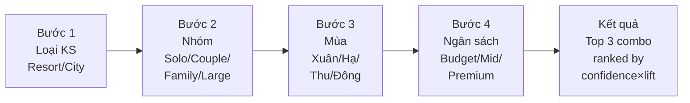
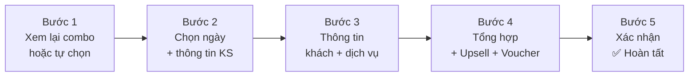
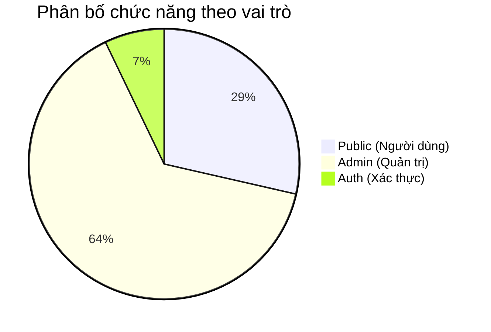

# 📋 Đặc Tả Chức Năng — TravelMind

> Tài liệu đặc tả chi tiết 28 chức năng của hệ thống, bao gồm mục đích, user story, giao diện, logic backend và API liên quan.
>
> **Kiến trúc Decoupled:** Mỗi tính năng bao gồm hai thành phần tách biệt:
> - **React Route (Frontend):** URL mà React Router quản lý trên SPA tại `frontend/`.
> - **API Endpoint (Backend):** REST API Flask tại `backend/` trả về JSON cho React fetch.

---

## PHẦN 1: Chức Năng Người Dùng (Public — 8 trang React)

---

### 1. 🏠 Landing Page (Trang chủ)

**React Route:** `/`  
**API Endpoint:** `GET /api/public/landing`

**Mục đích:** Tạo ấn tượng đầu tiên, giới thiệu hệ thống, dẫn dắt người dùng khám phá combo.

**User Story:** *"Là khách du lịch, tôi muốn thấy ngay các combo hot và có thể bắt đầu tìm kiếm combo phù hợp."*

**Thành phần giao diện:**

| Khu vực | Nội dung | Nguồn dữ liệu |
|---|---|---|
| Hero Banner | Ảnh nền + search bar (loại KS, nhóm, tháng) + CTA | Banner Manager (admin) |
| Combo Hot | 4 card combo có lift cao nhất | `association_rules` → `combos` |
| Stats Counter | 119,390 đặt phòng · 178 quốc gia · 15+ combo · 95% match | Tính từ `bookings` |
| Quiz CTA | "Bạn là kiểu du khách nào?" + nút bấm | Static |
| Xu hướng | Biểu đồ đường: lượng booking theo tháng | EDA từ `bookings` |
| Footer | Links, copyright, social | Static |

**Logic Backend:**
```python
# GET /api/public/landing -> JSON
def get_landing_data():
    hot_combos = Combo.query.filter_by(is_active=True).order_by(Combo.match_lift.desc()).limit(4).all()
    stats = data_service.get_summary_stats()
    active_banners = Banner.query.filter_by(position='hero', is_active=True).all()
    trends = data_service.get_monthly_trends()
    return jsonify({
        "combos": [c.to_dict() for c in hot_combos],
        "stats": stats,
        "banners": [b.to_dict() for b in active_banners],
        "trends": trends
    })
```

**API liên quan:**
- `GET /api/combos?sort=lift&limit=4` — Combo hot
- `GET /api/insights/trends` — Xu hướng theo tháng

---

### 2. 🏨 Hotel Explorer

**React Route:** `/hotels`  
**API Endpoint:** `GET /api/public/hotels`

**Mục đích:** Duyệt và so sánh 2 loại khách sạn (Resort vs City) với insight từ dữ liệu thực.

**User Story:** *"Tôi muốn xem thống kê thực tế của từng loại khách sạn và combo phổ biến cho nó."*

**Thành phần giao diện:**

| Khu vực | Nội dung |
|---|---|
| Bộ lọc | Hotel type, Season, Group, Price range |
| Hotel Card — Resort | Ảnh + stats (40,060 bookings, giá TB $95, peak Jul-Aug) + top 3 combo |
| Hotel Card — City | Ảnh + stats (79,330 bookings, giá TB $105, peak quanh năm) + top 3 combo |
| Insight Panel | Tỷ lệ hủy, phân bố bữa ăn, phòng phổ biến (lọc theo filter) |
| So sánh | Radar chart Resort vs City (giá, hủy, thời gian ở, dịch vụ) |

**API liên quan:**
- `GET /api/hotels` — Thống kê 2 loại KS
- `GET /api/combos?hotel_type=Resort` — Combo theo loại KS

---

### 3. 🎁 Smart Combo Builder ⭐ (CORE)

**React Route:** `/combo-builder`  
**API Endpoint:** `POST /api/combos/recommend`

**Mục đích:** Người dùng chọn tiêu chí → hệ thống gợi ý top 3 combo phù hợp nhất từ luật kết hợp.

**User Story:** *"Tôi muốn nhập thông tin của mình (loại KS, nhóm, mùa, ngân sách) và nhận gợi ý combo được cá nhân hóa."*

**Luồng hoạt động:**



**Input (từ người dùng):**

| Bước | Trường | Giá trị | Hiển thị thêm |
|---|---|---|---|
| 1 | `hotel_type` | `Resort` / `City` | Số lượng booking mỗi loại |
| 2 | `group` | `Solo` / `Couple` / `Family` / `Large` | % khách mỗi nhóm |
| 3 | `season` | `Spring` / `Summer` / `Autumn` / `Winter` | Giá TB mỗi mùa |
| 4 | `budget` | `Budget` / `Mid` / `Premium` | Range giá |

**Output (hệ thống trả về):**

Top 3 combo, mỗi combo gồm:
- Tên combo + mô tả (AI-generated)
- Danh sách dịch vụ (meal, room, parking, deposit...)
- Match % (confidence)
- Support, Confidence, Lift
- Giá ước tính ($/đêm)
- Nút "Đặt combo này" → Booking Flow

**Logic Backend (CORE):**

```python
# POST /api/combos/recommend
def recommend_combo(hotel_type, group, season, budget):
    # 1. Tạo antecedent từ input
    user_items = {f"Hotel_{hotel_type}", f"Group_{group}", f"Season_{season}", f"Price_{budget}"}

    # 2. Tìm rules có antecedent match
    matching_rules = []
    for rule in all_rules:
        if rule.antecedent.issubset(user_items) or user_items.issubset(rule.antecedent):
            score = rule.confidence * rule.lift
            matching_rules.append((rule, score))

    # 3. Rank theo score, lấy top 3
    matching_rules.sort(key=lambda x: x[1], reverse=True)
    top_3 = matching_rules[:3]

    # 4. Tạo combo response với mô tả, giá ước tính
    return build_combo_response(top_3)
```

**API:** `POST /api/combos/recommend`

---

### 4. 🧭 Traveler Quiz

**React Route:** `/quiz`  
**API Endpoint:** `POST /api/quiz/submit`

**Mục đích:** 5 câu hỏi trắc nghiệm → phân loại persona → gợi ý combo cá nhân hóa.

**User Story:** *"Tôi muốn trả lời vài câu hỏi vui và biết mình là kiểu du khách nào, kèm combo phù hợp."*

**5 câu hỏi:**

| # | Câu hỏi | Đáp án |
|---|---|---|
| 1 | Bạn thường đặt phòng trước bao lâu? | Ngay trước / 1-2 tuần / 1-2 tháng / 3+ tháng |
| 2 | Bạn ưu tiên gì nhất? | Giá rẻ / Tiện nghi / Vị trí / Bữa ăn đầy đủ |
| 3 | Cuối tuần lý tưởng? | Nghỉ resort / Khám phá TP / Làm việc / Du lịch xa |
| 4 | Bạn thường đi cùng ai? | Một mình / Người yêu / Gia đình / Bạn bè |
| 5 | Dịch vụ cần thiết nhất? | Đỗ xe / Yêu cầu đặc biệt / Ăn đầy đủ / Chỉ cần phòng |

**5 Persona kết quả:**

| Persona | Đặc điểm (từ data) | Combo gợi ý |
|---|---|---|
| 🧳 Planner | Lead 60-180d, Resort, HB, Family | Family Summer Pack |
| ⚡ Last-Minute | Lead < 7d, City, BB | Quick City Stay |
| 💼 Business | Corporate, City, Solo, BB | Business Express |
| 💑 Romantic | Couple, Resort, FB, Premium | Romantic Getaway |
| 👨‍👩‍👧‍👦 Family | Has children, Resort, HB, Parking | Family Fun Pack |

**API:** `POST /api/quiz/submit`

---

### 5. 📝 Booking Flow (Demo)

**React Route:** `/booking`  
**API Endpoints:** `POST /api/bookings`, `POST /api/vouchers/validate`

**Mục đích:** Mô phỏng luồng đặt phòng thực tế, tích hợp gợi ý upsell từ luật kết hợp và nhập voucher.

**Luồng 5 bước:**



**Thu thập đầy đủ dữ liệu cho tái phân tích (khớp 15 features):**

| Bước | Trường thu thập | Feature tương ứng |
|---|---|---|
| 1 | Hotel type (Resort/City) | → `Hotel_Type` |
| 1 | Room type (A-H) | → `Room_Type` |
| 2 | Check-in, Check-out | → `Season`, `Weekend_Stay`, `Weekday_Stay` |
| 3 | Adults, Children, Babies | → `Group_Size` |
| 3 | Country (quốc tịch) | → Phân tích địa lý |
| 3 | Meal (BB/HB/FB/SC) | → `Meal_Type` |
| 3 | Đỗ xe (0-8) | → `Parking` |
| 3 | Yêu cầu đặc biệt (0-5) | → `Special_Requests` |
| 3 | Loại đặt cọc | → `Deposit` |
| 4 | Voucher code | — |
| *auto* | Lead time = check_in − now | → `Lead_Time` |
| *auto* | ADR = total_price / nights | → `Price_Range` |
| *auto* | Market segment = "Direct" | → `Channel` |
| *auto* | is_repeated_guest (từ user history) | → `Repeat_Guest` |
| *auto* | customer_type = "Transient" | → `Customer_Type` |

> [!IMPORTANT]
> Tất cả booking mới từ web đều lưu đủ 15 features vào `user_bookings`, sẵn sàng merge vào pipeline phân tích luật kết hợp.

**Điểm đặc biệt — Bước 4 (Upsell từ luật kết hợp):**
- Hiển thị: "Khách tương tự bạn cũng chọn..."
- Ví dụ: đang chọn HB → gợi ý nâng FB (-10%), đang không đỗ xe → gợi ý thêm parking
- Ô nhập mã voucher → validate realtime

**API:**
- `POST /api/bookings` — Tạo booking
- `POST /api/vouchers/validate` — Kiểm tra voucher

---

### 6. 📊 Travel Insights

**React Route:** `/insights`  
**API Endpoints:** `GET /api/insights/trends`, `GET /api/insights/countries`

**Mục đích:** Trực quan hóa dữ liệu — trình bày như content du lịch hấp dẫn, không phải dashboard khô khan.

**Biểu đồ:**

| Biểu đồ | Loại | Thư viện | Dữ liệu |
|---|---|---|---|
| Heatmap mùa vụ | Tháng × Giá | Plotly | `bookings` group by month, adr |
| Bản đồ khách | Choropleth map | Plotly | `bookings` group by country |
| Radar Resort vs City | Radar chart | Chart.js | So sánh 6+ chỉ số |
| Xu hướng giá | Line chart | Chart.js | ADR theo tháng, 3 năm |
| Phân bố bữa ăn | Donut chart | Chart.js | Meal distribution |
| Lead time | Histogram | Chart.js | Lead time distribution |

**API:** `GET /api/insights/trends`, `GET /api/insights/countries`

---

### 7. 🎪 Event Page

**React Route:** `/events/:slug`  
**API Endpoint:** `GET /api/events/:id`

**Mục đích:** Trang chi tiết sự kiện đang diễn ra, hiển thị combo + voucher + banner liên quan.

**Thành phần:**
- Banner event (từ Banner Manager)
- Mô tả sự kiện (có thể từ AI)
- Combo gắn với event
- Voucher khả dụng
- Countdown timer (nếu có ngày kết thúc)

**API:** `GET /api/events/:id`

---

### 8. 👤 User Profile

**React Route:** `/profile`  
**API Endpoints:** `GET /api/auth/me`, `GET /api/bookings?user_id=me`

**Mục đích:** Trang cá nhân — lịch sử đặt phòng, voucher, quiz.

**Thành phần:**
- Thông tin cá nhân (edit)
- Lịch sử booking (demo)
- Voucher đã dùng / còn hiệu lực
- Kết quả quiz gần nhất
- Combo đã xem/yêu thích

**API:** `GET /api/auth/me`, `GET /api/bookings?user_id=me`

---

## PHẦN 2: Chức Năng Quản Trị (Admin — 18 trang React)

> Tất cả trang admin yêu cầu role `admin`. React Router sẽ kiểm tra auth context và redirect về `/login` nếu chưa đăng nhập. Layout: Sidebar cố định + Content area.

---

### 9. 📊 Dashboard KPI

**React Route:** `/admin`  
**API Endpoint:** `GET /api/admin/dashboard`

| KPI Card | Giá trị | Trend |
|---|---|---|
| Tổng Bookings | 119,390 | Theo năm |
| Tỷ lệ hủy | 37% | Theo tháng |
| Giá TB (ADR) | $102 | Theo mùa |
| Số quốc gia | 178 | — |

**4 biểu đồ:** Revenue theo tháng (line), Kênh đặt (pie), Lấp đầy theo mùa (stacked bar), Top quốc gia (horizontal bar).

**API:** `GET /api/admin/dashboard`

---

### 10. 📦 Combo Manager

**Route:** `/admin/combos`

**Chức năng:** CRUD combo. Mỗi combo gắn với 1 luật kết hợp, có giá, ưu đãi, ảnh, trạng thái.

| Thao tác | Mô tả |
|---|---|
| Xem danh sách | Bảng: tên, dịch vụ, sup/conf/lift, trạng thái, đã bán |
| Tạo mới | Chọn từ luật hoặc tạo thủ công. Gắn event, ảnh. |
| Sửa | Chỉnh tên, mô tả, giá, ưu đãi, ảnh |
| Xóa / Bật / Tắt | Soft delete, toggle active |
| Tạo nội dung AI | Nút "🤖 Tạo mô tả" → AI Content Studio |

**API:** `GET/POST/PUT/DELETE /api/admin/combos`

---

### 11. 🎫 Promotion Manager

**Route:** `/admin/promotions`

**Chức năng:** Tạo gói ưu đãi dựa trên insight từ dữ liệu. Hệ thống gợi ý cơ hội từ luật kết hợp.

**Đặc biệt:** Panel "💡 Gợi ý từ dữ liệu" — hiển thị cơ hội upsell phát hiện tự động.

**API:** `GET/POST/PUT/DELETE /api/admin/promotions`

---

### 12. 🎪 Event Manager

**Route:** `/admin/events`

**Chức năng:** CRUD sự kiện/chiến dịch. Gắn combo, voucher, banner. Lịch mùa vụ từ data.

**Đặc biệt:** Biểu đồ lịch mùa vụ (booking volume theo tháng) để gợi ý thời điểm tạo sự kiện.

**API:** `GET/POST/PUT/DELETE /api/admin/events`

---

### 13. 🖼️ Banner Manager

**Route:** `/admin/banners`

**Chức năng:** CRUD banner quảng cáo. Chọn vị trí (hero/sidebar/popup/footer), lịch hiển thị, gắn event/combo.

**API:** `GET/POST/PUT/DELETE /api/admin/banners`

---

### 14. 🎟️ Voucher Manager

**Route:** `/admin/vouchers`

**Chức năng:** Tạo mã giảm giá, điều kiện, giới hạn, theo dõi sử dụng.

**Đặc biệt:** Panel "💡 Gợi ý voucher" từ phân khúc khách hàng.

**API:** `GET/POST/PUT/DELETE /api/admin/vouchers`

---

### 15. 📈 Performance Reports

**Route:** `/admin/reports`

**Chức năng:** Báo cáo hiệu quả của combo, promotion, voucher.

| Báo cáo | Nội dung |
|---|---|
| Combo | Lượt xem, lượt đặt, conversion rate |
| Voucher | Tổng phát hành, đã dùng, % sử dụng |
| Promotion | Doanh thu trước/sau khi áp dụng |

**API:** `GET /api/admin/reports/combos`, `GET /api/admin/reports/vouchers`

---

### 16. 👥 Customer Analysis

**Route:** `/admin/customers`

**Chức năng:** Phân khúc khách hàng tự động thành 5 persona, hiển thị đặc điểm từng nhóm.

**5 phân khúc:** Planner (23%), Last-Minute (18%), Business (15%), Romantic (12%), Family (32%).

**API:** `GET /api/admin/customers/segments`

---

### 17. ⛏️ Rules Lab

**Route:** `/admin/rules`

**Chức năng:** Cấu hình và chạy thuật toán Association Rules (Apriori/FP-Growth).

| Tham số | Mô tả | Default |
|---|---|---|
| Thuật toán | Apriori hoặc FP-Growth | FP-Growth |
| Min Support | Ngưỡng support tối thiểu | 0.05 |
| Min Confidence | Ngưỡng confidence tối thiểu | 0.50 |
| Min Lift | Ngưỡng lift tối thiểu | 1.20 |
| Features | Chọn features đưa vào | Tất cả 15 |
| Chỉ booking thành công | Lọc bỏ canceled | ✅ Bật |

**Output:** Bảng luật (có filter/sort) + Network graph (mối liên kết giữa services) + Scatter plot (support vs lift).

**API:** `POST /api/admin/rules/run`, `GET /api/admin/rules`

---

### 18. 🗄️ Data Manager

**Route:** `/admin/data`

**Chức năng:** Duyệt, lọc, export dữ liệu booking gốc. Phân trang, tìm kiếm.

**API:** `GET /api/admin/bookings?page=1&hotel=Resort&month=July`

---

### 19. 🤖 AI Content Studio

**Route:** `/admin/ai/content`

**Chức năng:** Tạo nội dung văn bản bằng AI (mô tả combo, event, banner, voucher, email). Hàng đợi duyệt 3 bước.

**Luồng:** Chọn loại content → Chọn target → Chọn template → AI sinh 3 phiên bản → Admin chọn/sửa/duyệt.

**API:** `POST /api/admin/ai/content/generate`, `POST /api/admin/ai/content/:id/review`

---

### 20. 🎨 AI Image Studio

**Route:** `/admin/ai/images`

**Chức năng:** Tạo ảnh banner, combo card, event header bằng AI. AI tự tạo prompt từ ngữ cảnh. Editor chỉnh sửa.

**Luồng:** Chọn loại ảnh → AI tạo prompt → Sinh 4 ảnh → Admin chọn → Editor (crop, text overlay) → Duyệt.

**API:** `POST /api/admin/ai/media/generate-image`

---

### 21. 🎬 AI Video Studio

**Route:** `/admin/ai/videos`

**Chức năng:** Tạo video slideshow ngắn (10-30s) từ ảnh AI + text + nhạc nền. Dùng FFmpeg (local, miễn phí).

**API:** `POST /api/admin/ai/media/generate-video`

---

### 22. 📚 Media Library

**Route:** `/admin/ai/media`

**Chức năng:** Duyệt, quản lý tất cả ảnh/video AI đã tạo. Lọc theo loại, trạng thái, target.

**API:** `GET /api/admin/ai/media`

---

### 23. 📋 Template Manager

**Route:** `/admin/ai/templates`

**Chức năng:** CRUD prompt template. Mỗi template có biến tự động điền từ dữ liệu. Test thử ngay.

**API:** `GET/POST/PUT/DELETE /api/admin/ai/templates`

---

### 24. 📜 Content Review History

**Route:** `/admin/ai/history`

**Chức năng:** Nhật ký kiểm duyệt — ai tạo, ai duyệt, khi nào, trạng thái. Thống kê tỷ lệ duyệt.

**API:** `GET /api/admin/ai/history`

---

### 25. 🔑 API Key Settings

**Route:** `/admin/settings/api-keys`

**Chức năng:** Nhập/đổi API key cho từng AI provider (Gemini, OpenAI, Stability AI, FFmpeg). Test kết nối. Mã hóa AES-256.

**Providers:**

| Service | Provider | Key cần |
|---|---|---|
| Text | Google Gemini | API Key |
| Text | OpenAI GPT | API Key |
| Image | DALL-E 3 | API Key (cùng OpenAI) |
| Image | Stability AI | API Key |
| Video | FFmpeg | Không cần (local) |

**API:** `GET/POST /api/admin/settings/ai-providers`, `POST /api/admin/settings/ai-providers/:id/test`

---

### 26. 📊 AI Usage Dashboard

**Route:** `/admin/settings/ai-usage`

**Chức năng:** Theo dõi usage AI: tokens, credits, chi phí, giới hạn ngân sách, biểu đồ theo ngày.

**API:** `GET /api/admin/settings/ai-usage`

---

## PHẦN 3: Xác Thực (Auth — 2 trang React)

---

### 27. 🔐 Đăng nhập

**React Route:** `/login`

**Fields:** Username/Email + Password + Remember me

**Logic:** Gọi `POST /api/auth/login` → nhận cookie session → React Context cập nhật trạng thái auth → Redirect (user → `/`, admin → `/admin`)

---

### 28. 📝 Đăng ký

**React Route:** `/register`

**Fields:** Username + Email + Full name + Password + Confirm password

**Logic:** Gọi `POST /api/auth/register` → Backend validate → Hash password → Tạo user (role=user) → Auto login → Redirect `/`

---

## Tổng Kết



| Nhóm | Số lượng | Core Features |
|---|---|---|
| Public | 8 | Smart Combo Builder, Traveler Quiz, Booking Flow |
| Admin - Kinh doanh | 7 | Combo, Promotion, Event, Banner, Voucher, Reports, Dashboard |
| Admin - Dữ liệu | 3 | Customer Analysis, Rules Lab, Data Manager |
| Admin - AI | 6 | Content Studio, Image Studio, Video Studio, Media, Templates, History |
| Admin - Hệ thống | 2 | API Key Settings, AI Usage Dashboard |
| Auth | 2 | Login, Register |

---

> [!NOTE]
> **Tài liệu liên quan:**
> - API Reference chi tiết → [07_api_reference.md](./07_api_reference.md)
> - Database Schema → [05_database.md](./05_database.md)
> - Kiến trúc hệ thống Decoupled → [04_kien_truc_he_thong.md](./04_kien_truc_he_thong.md)
> - Routes React tại: `frontend/src/App.jsx`
> - Routes Flask API tại: `backend/app/routes/`
